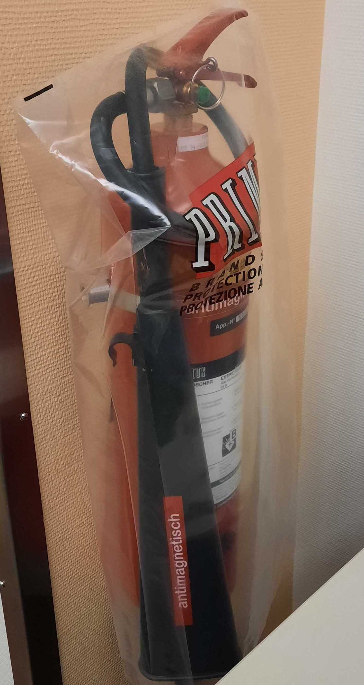
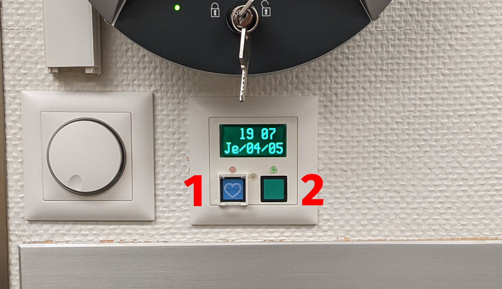

!!! note "Reminder: Phone number of internal emergency services can be found in the agenda of all the phones of the hospital."

## Fire in the scanning room
- [ ] Immediately call the internal firefighter service at **{{ secrets.phones.firefighter | default("███") }}**.
- [ ] Enter in the MRI room and cut the electricity in the MRI room by pressing the red button next to the entrance.

    !!! danger "Cutting electricity will NOT turn off the magnetic field!"

- [ ] Remove the subject from the scanner's room, applying the [manual extraction procedure described below](#manual-extraction-procedure).
- [ ] Close the scanner's room.
- [ ] Retrieve the MR-compatible extinguisher from its designated corner of the control room (see picture below) and put it in front of the scanning room.

    !!! danger "Conventional extinguishers MUST NOT be entered in the scanning room because the magnetic field is still active"

        

## Emergency quench

!!! danger "The quench button is to be used only in the case of an emergency in which a person is injured and the only safe way to avoid further injury is to decrease the magnetic field strength of the magnet."

    - [ ] Lift the security cover to free the *red, mushroom-shaped* button with the **STOP** word written on it, and push it.
        

!!! important "Fire in the scanner's room does not justify quenching unless the high field poses a direct threat to a person's health"

## Participant set the alarm

!!! danger "**If at any point the participant rings the alarm**, you MUST check on the participant IMMEDIATELY with the scanner's speaker system."

    - [ ] Press the speaker button (1 in the picture below) and ask if everything is alright. It is possible that the participant triggered the alarm by mistake.
        

        !!! warning "Pressing the speaker button (1) or the crossed-bell button (4) will turn the alarm off and open the speaker line to talk to the participant."

- [ ] Assess the participant and the situation by asking them what is wrong and checking the camera inside the room and the scanner's console.

!!! important "If you can anticipate that the participant will need to be retrieved"

    Initiate the extraction of the bed from the scanner console using the *Room in* menu (lower left corner of the screen), and then click on the *home* (:fontawesome-solid-house:) button.

## Alarm event requires further safety procedures
- [ ] Enter the scanning room if you do not get a response or the answer is unclear.

    !!! danger "If there is an impending risk to the participant's health and it is safe for you and other operators to intervene, take actions to avert the dangerous situation."
        For example, if the participant is choking because of the accidental occlusion of their respiratory ways after the displacement of some experimental instrument or sensor, immediately extract them from the scanner's bore with the fastest procedure available to you and remove the occluding instruments.
        
        Similarly, suppose the participant suffers an acute panic attack and starts violently and uncontrollably shaking on the table. In that case, you will first lift the security side rails of the bed and securely restrain the participant further within the scanning table if necessary. This is critical to preempt their body from falling off the table while the head coil is still attached. Only when you can safely do so, extract them from the bore and remove the head coil.

## Participant possibly needs to be retrieved but there isn't impending risk to their health
- [ ] If the alarm is still blaring, press the large, circular button at either side of the scanner's bore.
    

- [ ] Make the participant aware that you entered the room and ask them what is wrong.

    !!! danger "If the participant is unresponsive, extract them from the scanner's bore using the standard procedure (the *Home* button). In case you previously cut the electricity or failure of the standard procedure, follow the manual procedure described in the first steps of [manual extraction protocol](#manual-extraction-procedure)."

- [ ] Determine whether the participant can continue the session after some comforting or information or if it must be stopped at that point (e.g., the participant is feeling claustrophobic and cannot continue).
- [ ] If the session must be stopped, or you determine it is necessary to extract the participant before making that decision, hit the "Home" button to bring the participant outside the scanner's bore quickly.
        

## In case you feel unsafe

!!! warning "If you feel unsafe for any reason (for example, because a patient behaves aggressively or threatens you), **CALL SECURITY at {{ secrets.phones.security | default("███") }}**."

## Technical difficulties

!!! important "If you are facing technical difficulties:"
    - [ ] Seek help from anyone on the BH7 floor.
    - [ ] If you still have problems or didn't find anyone (e.g., scanning on a weekend), call the ER's MRI staff at {{ secrets.phones.emergency_IRM | default("███") }}.

## A person requires medical attention

At any moment, you may determine that the participant will require medical attention:

  - The participant's health has been threatened or is actively at risk (e.g., elevated heart frequency, lack of pulse, respiratory issues, unconsciousness, dizzyness, unsteadyness, etc.)
  - The participant is unresponsive
  - The participant reports feeling unwell and needs attention
  - You think they may need medical attention but you are unsure.

!!! danger "If you determine that someone needs medical attention, call the resuscitation unit (**{{ secrets.phones.intensive_care | default("███") }}**)"

    The resuscitation unit (**{{ secrets.phones.intensive_care | default("███") }}**) is the person to call in any case, **even if the participant is not in life-threatening condition**.

    The phone number of the emergency services can be found on all the phones at CHUV.

**After you called the resuscitation unit**:

- [ ] Press on the heart button :octicons-heart-16: —(1) in the picture below— on the wall, after lifting the security lid.

    |  |
    |:--:|
    | The heart button :octicons-heart-16: (1) initiates a beacon to guide the intensive care team to the place where they need to intervene; (2) cancels the beacon. |

    !!! important "In case you pressed the heart button by mistake, turn it off by pressing the adjacent green button (2)."

- [ ] If the participant remains in the scanning room, re-enter the room and proceed with the [manual extraction protocol](#manual-extraction-procedure).

!!! danger

    If the resuscitation team needs to shock the participant for cardiac resuscitation, it must never be done on the MR table.

## Manual extraction procedure
- [ ] If the bed is inside the bore:
    - [ ] Unlock the manual retrieval of the scanner's bed
    - [ ] Pull the bed all the way out of the bore
    - [ ] Lock the manual retrieval back
- [ ] Lift the table's breaks locking the wheels
- [ ] Lift the manual lock of the table's attachment to the bore.
- [ ] Pull the bed out of the scanning room
- [ ] Reassess the participant's health in the control room and determine a course of action.

!!! warning "Resetting the scanner's table after it's been manually detached"

    - [ ] Dock the table onto the scanner's bore by insert the arrow-shaped prong into the docking bay.
    - [ ] Wait for the MRI screen to indicate it is ready for docking, push down the right attachment pedal with your foot for locking.
    - [ ] Simultaneously press the up and down buttons to activate the automatic recalibration of the table.

## Immediately report incidents
!!! warning "MRI coordinators must be informed"

     Once the situation is resolved, and before anything else, send an email to {{ secrets.email.mri_coordinator_chuv1 | default("███") }} and {{ secrets.email.mri_coordinator_chuv2 | default("███") }}. Make sure to report **any potential risk you can anticipate to clinical activity the following day**.
