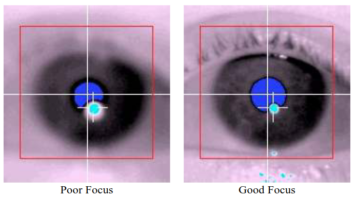
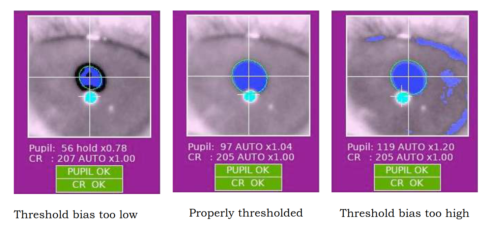

!!! abstract "Please note that some of the images used in this section are sourced from the [ET manual](../assets/files/EL1000Plus_UserManual_1.0.20_GOP.pdf)."

## Setting viewframe and focusing

!!! warning "To ensure accurate performance and prevent minor drifts in the pupil and corneal reflection (CR) thresholds, perform the ET Setup 10-15 minutes after powering the ET on."

- [ ] Initiate the fixation program on the stimuli laptop (*{{ secrets.hosts.psychopy | default("███") }}*), by typing the following on a terminal:

    ??? warning "Make sure to have the correct environment loaded before invoking the task"

        - [ ] Deactivate conda (if active):
            ``` shell
            conda deactivate
            ```
        - [ ] Load the new virtual environment:
            ``` shell
            source $HOME/psychopyenv/bin/activate
            ```

    ``` shell
    cd ~/workspace/HCPh-fMRI-tasks
    python {{ settings.psychopy.tasks.dwi }}.py
    ```

    A modal dialog will ask you for the number of trial (automatically calculated, DO NOT modify) and the session number.

    !!! danger "The following two steps MUST be executed in this order"

            - [ ] Drag and drop the modal dialog into the scanner's projector screen.
            - [ ] Update the session number with the corresponding number.

- [ ] Press <span class="keypress">Enter</span> to begin the *Camera Setup Mode*.

    !!! tip "The *Camera Setup Mode* contains a view of one eye, and you can switch that view between two modes"

        - The *Head Camera* will allow you to "find" and aim the right eye, as it has a wider field-of-view.
        - The *{{ settings.eyetracker.eye | title }} Eye Camera* is a zoomed clip of the eye, if it is properly identified by the software (i.e., the eye is fully within the field-of-view of the camera).

- [ ] Switch to the *Head Camera* mode by pressing the <span class="keypress">:fontawesome-solid-caret-left:</span> or <span class="keypress">:fontawesome-solid-caret-right:</span> arrow.
    This will allow you to adjust the ET position as the infrared camera provides feedback inside the scanning room on the projection screen.
- [ ] Enter the scanning room.
- [ ] Ask the participant to slide the mirror with their hands until the infrared mirror fully covers the image on the screen.
- [ ] Action the ET arm position looking at the *Head Camera* view that should be now projecting on the screen to ensure the {{ settings.eyetracker.eye }} eye is in the center of the field-of-view.

    !!! warning "The **{{ settings.eyetracker.eye }}** eye should be visible at the center of the coil's square window for the eye."

        { align="right" }

        - [ ] To adjust the camera position, slightly unscrew the fixation locks of the camera arm, move the arm in search of the correct position, and tighten the locks again on the desired position.
        - [ ] **If the eye coverage is still inappropriate**, realign the mirror frame position by sliding it along the rails attached to the coil.
            You may ask the participant to do it while inside the bore.
        - [ ] **If the eye coverage is still inappropriate**, re-adjust the participant's head positioning inside the coil.
            You'll need to extract the bed outside of the bore for this by pressing the **Home** (:fontawesome-solid-house:) button.
        - [ ] **If the eye coverage is still inappropriate**, revise the vertical position of the infrared mirror with respect to the standard mirror (this will require new gloves and replacing the tape to stick the infrared mirror).
            Even a tiny adjustment can impact calibration and eye positioning.
        - [ ] Repeat the previous steps until the eye is properly aimed and focused.
        - [ ] As a last resort, you can also adjust the strength of the infrared light (emitter).
            This is the black box on the opposite side of the lens on the ET arm.
            Under the emitter there are two little screws.
            Unscrew, move the emitter front/back, check the contrast of the face image, re-screw.

- [ ] Tighten the nut that locks the arm's position.
- [ ] Focus the lens so that the image is sharp (e.g., the eyebrows and eyelashes are well defined).
    
- [ ] Switch the ET to *{{ settings.eyetracker.eye | title }} Eye Camera* mode (zoomed in).
- [ ] Verify that the eye is still well covered by the view and the pupil is segmented.
- [ ] Press the <span class="keypress">A</span> key to set the pupil and CR detection thresholds automatically.
- [ ] Check that two crosses appear on the eye.
- [ ] Fine-tune the pupil detection threshold using the <span class="keypress">:fontawesome-solid-caret-up:</span> and <span class="keypress">:fontawesome-solid-caret-down:</span> arrow keys if necessary.
    While checking the pupil/CR image and thresholding, ask the participant to look at the screen corners to verify correct detection even in extreme positions.
    

**At this point, the pupil should correctly be seen and segmented**, and the crosses on the ET computer should appear in the {{ settings.eyetracker.eye }} eye.

- [ ] Inform the participant that you are leaving the room.
- [ ] Exit the camera mode by pressing <span class="keypress">Enter</span>.

## Calibration

- [ ] On the eye-tracking (ET) computer, ensure that the appropriate calibration type is selected (9-point for QCT and 5-point for resting state and breath-holding tasks):
    - [ ] Click on <span class="keypress">Set Options</span> located on the right side of ET computer screen.
    - [ ] Under **Calibration type** in the top left corner, choose the image containing either 9 or 5 points.

        

- [ ] Two crosses should appear on the ET computer screen: one at the center of the pupil and the other at the center of the corneal reflection.

    !!! warning "If the two crosses do not appear, the coverage, focus and intensity of the ET are incorrect"

        - [ ] Repeat the steps for their setting up given [above](#setting-viewframe-and-focusing).

- [ ] Initiate the ET calibration by pressing <span class="keypress">C</span> on the laptop keyboard or by clicking on <span class="keypress">Calibration</span> on the ET interface.
- [ ] Once the participant's gaze stabilizes on the first fixation point, the <span class="keypress">Accept Fixation</span> button turns green.
    Click on it to confirm the initial position.

    

- [ ] Subsequent positions should be automatically validated when the gaze remains stable.
    If not, manually click the <span class="keypress">Accept Fixation</span> button when it turns green.
- [ ] After the calibration, ensure that the fixation points' positions match the expected pattern corresponding to the 9- or 5-point calibration.
    If the pattern appears too distorted, restart the calibration.
- [ ] Upon successful calibration, initiate validation by clicking <span class="keypress">Validation</span> on the ET interface or pressing the <span class="keypress">V</span> key on the laptop keyboard. Follow the same instructions as in the calibration to validate positions.
- [ ] If validation fails, repeat previous steps and restart calibration. Otherwise, you can leave the calibration mode and proceed with the task program by pressing the <span class="keypress">Esc</span> key on the laptop (*{{ secrets.hosts.psychopy | default("███") }}*).

## Drift check
