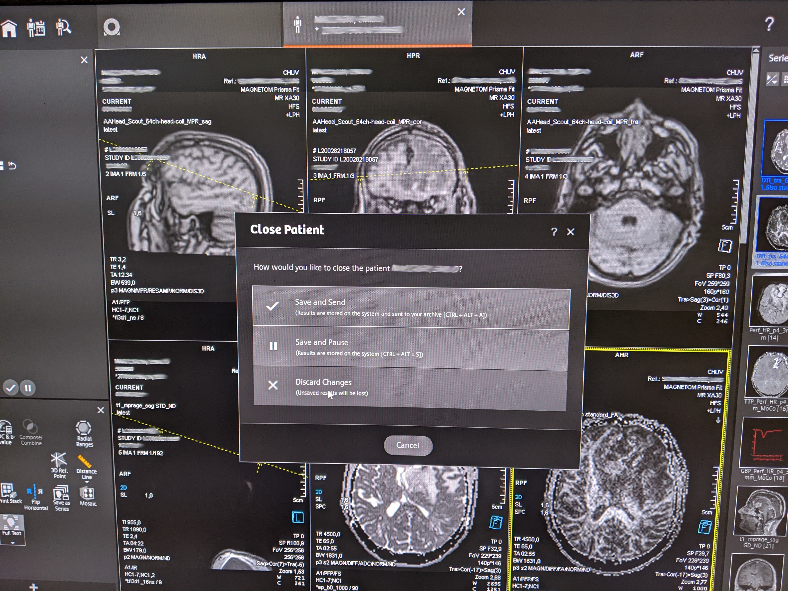
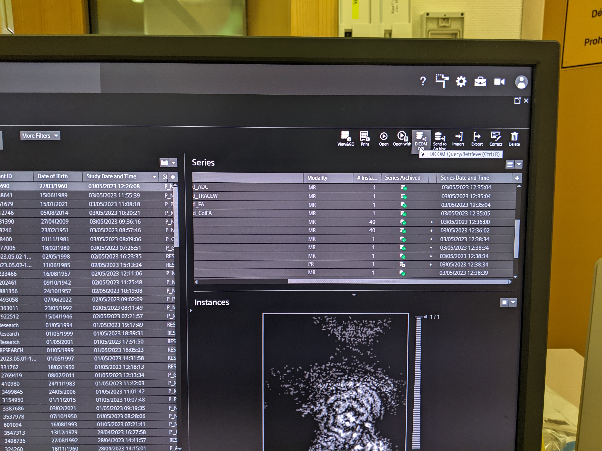
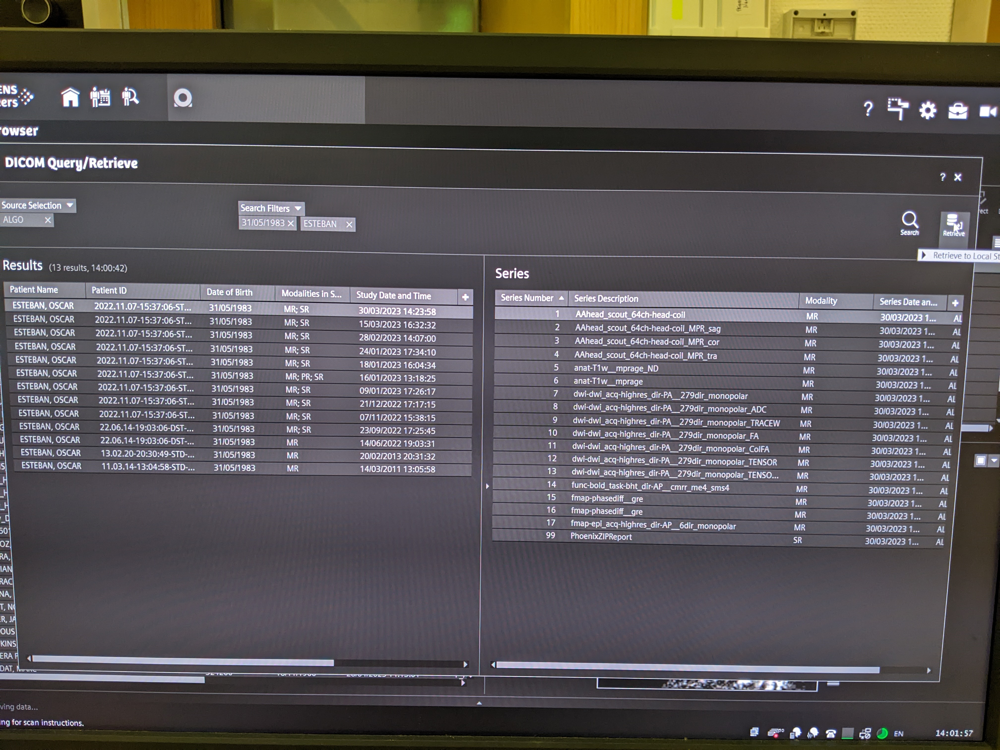
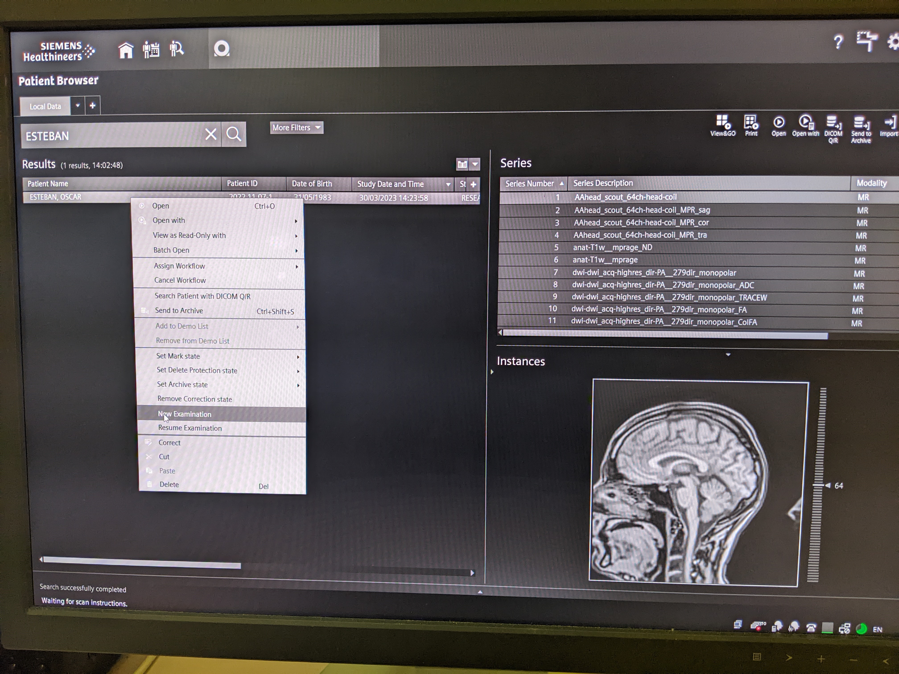
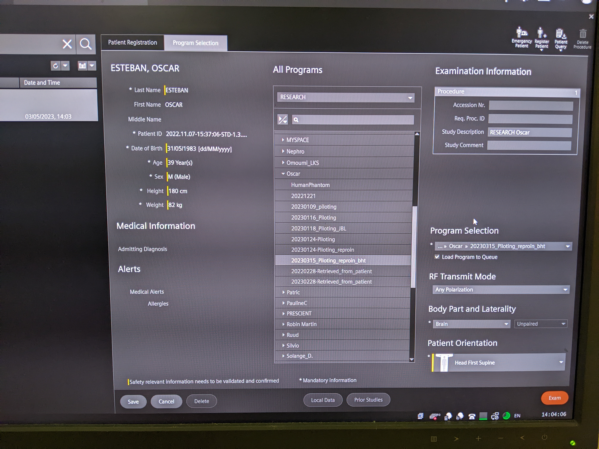
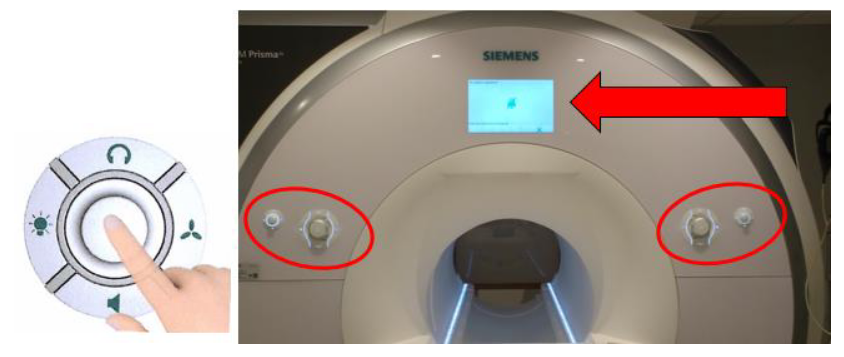

!!!warning "Procedures for when the participant has arrived"
    It is critical to stay alert and anticipate any potential risk to the participant to avert them.
    This is particularly important for the first session.

## Preparation of the participant in the CONTROL ROOM

- [ ] Have participant fill out consent documents and MRI safety screener, and verbally confirm responses, paying attention to frequently forgotten devices and implants, like orthodontia.

!!!danger "DO NOT subject the participant to any risk"
    - [ ] In case of any doubts emerging from the MRI safety screening, contact {{ secrets.people.medical_contact | default("███") }} immediately at {{ secrets.phones.medical_contact | default("███") }}. **DO NOT PROCEED** if the medical contact cannot be reached.
    - [ ] In case of discovering any previously undisclosed contraindication, the volunteer **MUST NOT** participate in the study.

!!!warning "Only female participants, only the first session"
    - [ ] Provide the participant with a pregnancy test and a urine sample cup.
    - [ ] Go over the instructions with them.
    - [ ] Accompany them to the bathroom (situated at {{ secrets.rooms.bathroom | default("███") }}), and ask whether there is anything else they anticipate they will need.
    - [ ] If the test is positive, the volunteer **MUST NOT** participate in the study. You MUST be understanding of the situation as most likely the person will not be aware of the circumstance.

- [ ] Remind the participant to use the bathroom at this moment if they need ({{ secrets.rooms.bathroom | default("███") }}).
- [ ] Have participant empty their pockets or change into scrubs, and remove all jewelry/hair accessories and check for any missed metallic objects with the scan center's preferred method.
- [ ] Instruct participant on staying still and encourage them to request breaks if necessary.
- [ ] Describe the participant how the session will develop, with special attention to tasks. In the first session, show the task while explaining them for clarity. Answer all the questions that may arise.

    > There will be three tasks during the session.
    > The first one will be the resting-state; for this scan, all you have to do is stay still and look at the movie.
    > Please do not close your eyes.
    >
    > The second one is going to be breath-holding task; we will ask you to breathe with a specific pattern following the color of the rectangle.
    > 
    > You will watch five repeats of the same block.
    > The first time the experimental block is shown, please keep your habitual breathing pace disregarding the task instructions.
    > At the end of this mock block, a message will remind you that you must adapt your breathing to the pace indicated by the color-changing rectangle in the center of the screen for the remaining four repetitions of the block.
    > Please inhale while the green rectangle is on, and exhale while you see the yellow rectangle.
    > To tell you that the breath-hold is approaching, the green color will be lighter and the yellow will become orange for the last breathe-in and breathe-out.
    > Then a red rectangle will follow the last breathe-out (orange color), and you will need to hold your breath throughout.
    > The red rectangle will become pink to signal that you will soon be able to breathe again.
    > When the colored rectangle disappears, please exhale any remaining air in your lungs (without  unnatural efforts to push the air out) and breathe normally until the next block starts.
    > At the end of the breath-hold, please exhale the small amount of air you have remaining so we can measure the CO2 level via the gas analyzer.
    > We will repeat this block of inhale/exhale 5x followed by hold 6 times. The first time, you must look at the rectangle but ignore the breathing instructions and 
    > just breath normally. A warning message will indicate when you should start following the breathing clues.
    >
    > Any questions about the breath-holding task?
    >
    > The third task is a control task. This task is composed of different subtasks.
    > In the first subtask, a grating pattern will display. Just look at the fixation point represented by a red dot.
    >
    > In the second subtask, please follow the points with your eyes.
    > It is critical that you move your eyes without moving your head.
    >
    > In the third subtask, the word left and right will flash alternatively.
    > Please tap your thumb against your four other fingers sequentially.
    > Do it with your right hand while the word "RIGHT" is displayed, and correspondingly with your left hand after with the word "LEFT". Stop when the words disappear.
    > During the finger tapping, you MUST leave the alarm button, e.g., on your belly.
    > In the fourth subtask, a dot appears at the center of the screen.
    > Look a the dot until the subtask is finished.
    >
    > Is everything clear to you? Do you have any questions?

- [ ] Tell the participant they will be holding an alarm button throughout the session, and that they may use it any time whenever they need to stop the experiment.
    - [ ] Tell the participant that they MUST leave the alarm button, e.g., on their belly, during the positive control task. Indicate that you will remind them of this before starting the task.
- [ ] Indicate the participant where the door to the changing room is, and ask them to change clothes if necessary.
- [ ] Ask the participant to place the ECG electrodes on the location indicated by the picture below.
    - [ ] Clean the skin with [WHAT?].
    - [ ] Remove the protective film from the electrode.
    - [ ] Stick the electrode on your skin by starting in one side and ironing the rest of the electrode. This procedure ensures that no air is trapped between the electrode and your skin and that no wrinkles from at the edges. Repeat for the three electrodes.
        

## Preparation of the scanning protocol (control console)

- [ ] Close open patients discarding changes.
    
- [ ] Search for the participant by clicking on the "Patient Browser" in the top left corner.
      If the participant is not shown (because it is archived and hence not locally found):
      - [ ] Click on the *DICOM Q/R* button on the top-right area.
          
      - [ ] Introduce some unambiguous search criteria:
          
      - [ ] Select the subject (left column) or the sequence (right column) you want to retrieve and hit *Retrieve*. Be careful, **you probably want to retrieve a subject**, that means make sure you have selected a row on the left column:
          
      - [ ] Go back to the "Patient Browser" and check that the patient now shows up in the local search.
- [ ] Check the head coil **is not** plugged before initiating a "New examination" to ensure good SNR of the localizer sequence.
- [ ] Right click and select "New examination".
    
- [ ] In the *Program Selection* tab:
    
    - [ ] Enter the weight and height of the participant.
    - [ ] Select the right protocol under "RESEARCH/Oscar".
    - [ ] Select *Brain* as the organ.
    - [ ] Select the *Position* as "Head First Supine".
    - [ ] Before you hit Exam, you can edit general patient's data by changing to the *Patient Registration* tab if you need to edit general information about the patient.
    - [ ] Click the Exam button (red background, rightmost-bottom).
    
- [ ] Load the adequate protocol, making sure of loading the right phase-encoding (PE) direction corresponding to the session.
    - [ ] Double-check that all PE prescriptions are correct.

## Installing the participant in the SCANNING ROOM

!!! info "Thanks"
    Some of the pictures in this section have been extracted from the [Ghent Institute for functional and Metabolic Imaging MRI User 2019](http://gifmi.ugent.be/drupal/system/files/documents/GIfMI_MRI%20user%20manual_BASIC_SiemensPrisma_EN.pdf) written by Stephanie Bogaert, MSc, Pieter Vandemaele, MSc and Pim Pullens, PhD. We express our gratitude that they put together such a comprehensive guide.

- [ ] Have the participant remove in shoes at the entrance of the scanning room.
- [ ] Bring the participant inside the room, and give them the ear-plugs to protect the hearing during acquisition.
- [ ] Instruct the participant to lay on the MRI bed.
- [ ] Connect the ECG leads on the three electrodes. The electrodes MUST be connected following the color scheme [ADD DETAILS]
- [ ] Install the respiration belt below the participant's chest and connect it to the tube as shown in the picture below. The respiration belt measure the displacement induced by breathing, it thus needs to surround the chest or stomach comfortably, depending on the subject respiration (diaphragmatic or chest breathing). The belt should be tight.

- [ ] Place the nasal cannula in the nose of the participant making sure the two protrusions are aligned with the nostrils of the participant. Place the tube behind the ears and tighten under the chin for comfort and stability by sliding the ring as shown in the picture above.
- [ ] Check that the GA is properly working by asking the participant to do the following task: breathe in for 3s, breathe out for 3s. Do it 3x. Give orally the instructions "breathe in"/"breathe out" to make the task easier. After the last "breathe out", ask the participant to hold their breath for 3s and then let them breathe normally again [TO DO: INSERT PICTURE OF WHAT THE SIGNAL SHOULD LOOK LIKE]. 
- [ ] Once the subject is lying on the MR bed, check that no arms/legs lye on the GA or the RB tubes.
- [ ] Give to the participant the emergency button. Make the participant try it, so they can see it works. To switch off the alarm, there's a button on the scanner (circular, both on the left and on the right of the hole) 

    

- [ ] Adjust the participant inside. With the paddings, their head position MUST be adjusted and elevated so that the nose and the forehead of the participant are both close to the upper coil. This procedure ensures the ET has the clearest possible view of eye.
- [ ] This part must be repeated taking out and putting back the upper part of the head-coil, adjusting the pillow at every step, until the head is fixed and the nose and forehead of the participant almost touch the coil. In case of need, ask the participant to "say yes" with the head (chin on neck) and keep this position, place the pillows, place the coil and check that the participants' front touches the coil. Now the nose can also be a bit far from the coil. Tell the participant to relax the neck, so the nose should go a bit up and touch the coil.  
    
    
- [ ] Take the Ears-protection pillow, stick it on top of the ears of the participant, one by one. Once they are settled, you can pump it, until the participant is comfortable, the head is fixed and the ears are protected.

    

- [ ] Ask the participant if they are feeling cold. Cover them with a blanket if necessary.
- [ ] Solicit feedback on participant's comfort while positioning them on the scanner bed and suggest ergonomic positioning of arms to avoid discomfort. Remind the participant not to create closed loops by crossing their legs or holding their hands together.
- [ ] Gently move the participant with the manual regulation. Stop when the head is under the head-localizer. **Ask the participant to close their eyes**, press the laser alignment button and align the head-coil markers with the red light.

|  |
|:--:|
|  |

- [ ] Switch off the alignment light, now the participant can open their eyes. You can move the participant (always gently as before) inside the scanner manually, until the mm counter marks "Isometric" or you can press the rotary knob for two seconds. This will send the participant to the isocenter automatically.

    

- [ ] You should see the projection of the calibration mode as you left it open before.
- [ ] Regulate the ET position until you see from the projector screen the eye. Once the eye is well seen and tracked, the image is zoomed (externally by the operator in front of the PC-tower) to the pupil and two crosses appear on the eye. In case of need, the right lens can be manipulated rotating the roller, like what you would do with your reflex to obtain the focus. If the position of the ET is not satisfying, you can move the base. As a last resort, you can also adjust the strength of the infrared light (emitter). This is the black box on the other side with respect to the lens. Under the emitter there are two little screws. Unscrew, move the emitter front/back, check the contrast of the face image, re-screw.

    

- [ ] If the pupil is correctly seen, as well as the eye (indicated by the crosses following their movement), you can go out.
    - [ ] Inform the participant that you are leaving the room, and that you are going to first check with them whether the speaker works well, immediately.

- [ ] Make sure the speaker is audible (and not annoying) and confirm the participant's feedback: 
    - [ ] Keep on pressing the speak mode button to give instructions (1). Set the volume control of your microphone by pressing the +/- buttons.
        > Hey [NAME], can you hear me well ?

    - [ ] To listen to participant answer, press the listen mode button once (2). Loosen the speak mode button! Set the volume control of the participant’s microphone by pressing the +/- buttons.

        - [ ] If this volume increase is not enough for the participant to hear you well, proceed as follow:
            - [ ] In the Siemens program, click on Configuration represented by a gear wheel at the top right of the screen.
            - [ ] Click on `Configuration panel`
            - [ ] Under the section `Scan application`, locate the icon of the speaker and tune the volume to the maximum.
            - [ ] Click `Apply`

    !!!warning "Important"
        The red button (3) is the table stop button. Pressing this will immediately stop your sequence from
        running and will stop the participant table movement.

      

- [ ] Switch the ET camera back to zoomed mode, and exit the camera mode by pressing Enter.
