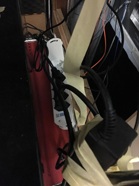
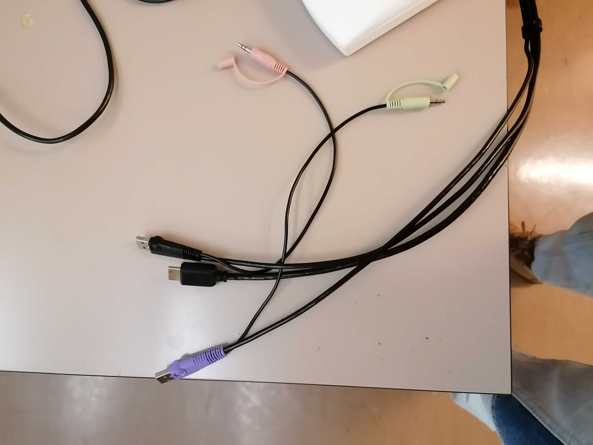
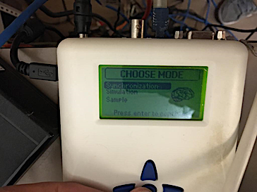

!!! info "Thanks"
    All the documentation about the eye-tracker is derived from Benedetta Franceschiello's user guide.

Instructions of operations to be performed before the participant arrival, **before EACH session** (i.e., DAY OF SCAN)

## Documentation and other non-experimental devices

- [ ] Prepare [the informed consent form](../assets/files/icf_FR.pdf) (first session only)
- [ ] Prepare an MRI safety screener ([EN](../assets/files/safety_form_EN.pdf)|[FR](../assets/files/safety_form_FR.pdf))
- [ ] Prepare a receipt form that the participant will sign when they are given the compensation.
- [ ] Check you have the AcqKnowledge software USB license key.
- [ ] Prepare a pregnancy test (**Only female participants on their first session**)
- [ ] Prepare a thermometer.
- [ ] Prepare a blood pressure meter.
- [ ] Prepare scrubs and MR-compatible glasses if applicable

## Basic preparations in the scanning room

- [ ] If the scanner is shut down, boot it up.
- [ ] Remove the head coil that is currently installed.
    - [ ] If it is the 64-channel, you can just temporarily move it into the scanner's bore.
    - [ ] Otherwise, store it on the shelf where the other coils are and bring the 64-channel one in the proximity of the bed (e.g., inside the scanner's bore). Make sure to remove other coil's fitting element.
- [ ] Remove the spine coil by lifting the corresponding latch, then sliding it toward the head of the bed, lift it from the bed, and place it on the floor ensuring it is not obstructing any passage or unstable.
- [ ] Place the two back padding elements filling the spine coil socket.
- [ ] Fix the 64-channel head-and-neck coil onto the head end of the bed and connect the coil's terminal cable. Check that the head-and-neck coils are now detected by the scanner, as indicated in the scanner's monitor screen.

## Setting up the BIOPAC system and physiological recording sensors

- [ ] Ensure you have the USB key with the BIOPAC software license.
    - [ ] Plug the USB key to the computer *{{ secrets.hosts.acqknowledge | default("███") }}*. It needs to stay plugged at all times during the acquisition. [INSERT PHOTO]
- [ ] Plug the power cord of the BIOPAC and of the GA into suitable power sockets.
- [ ] Plug in the Ethernet (the plug is on the back side) to one USB input of *{{ secrets.hosts.acqknowledge | default("███") }}*, using the Ethernet-to-USB adaptor.
    
- [ ] Go inside the scanning room, unscrew the wood cap that covers the hole in front of the MR.
- [ ] Delicately pass a long tube that will be connected to the nasal cannula through the front access tube. Connect the tube and the cannula and leave it ready on the bed ready for the participant.
- [ ] Pass the respiration-belt (RB) tube through the same hole. Again, connect the end inside of the scanning room to the respiration belt and leave it on the bed.
- [ ] Connect the end of the control room to the TSD160A BIOPAC unit, using the the plug marked negative (**-** symbol).
- [ ] Connect the coaxial end of the cable to the CO2 output in the back of the GA, the other end of the cable should be a jack plug (similar to headphones).
- [ ] Connect the other end (jack plug) into the input end of the INISO/A filter.
- [ ] Connect one end (RJ-11 to RJ-11) into **channel 3** of the AMI100D BIOPAC module, and the other end to the output of the INISO/A filter.
- [ ] Check that the exhaust pipe (back of the GA) is free of obstruction.
- [ ] The **pump switch MUST BE OFF** (front of the GA).
- [ ] Remove the cap of the gas input, connect an inline filter. The inline filter MUST be discarded after some ten sessions.
- [ ] Connect the drying tube and/or the desiccant chamber.
    
- [ ] Turn the GA on using the on/off switch located at the back of the GA. The GA **MUST be ON for 20-30 min** to warm-up before measuring.
    
- [ ] Connect the end of the control room to the corresponding designated gas intake plug in front of the GA.
    
- [ ] connect the cable from the RJ-45 output of the syncbox to the first filter (BNC connector; has a label "External signal") in the cupboard covering the access panel to the Faraday cage. The cable might be stored in the lower left cupboard of office {{ secrets.rooms.et_camera | default("███") }}. Make sure you will have access to the cable with sufficient time ahead.

## Setting up the eye-tracker

- [ ] The eye-tracker (ET) computer is kept on its designated rolling table, which is stored under the projector in room {{ secrets.rooms.projector | default("███") }}. Behind the rolling table, there is a transparent panel (the *plexiglas* in the following) where the ET camera will stand inside the scanner bore.
- [ ] Verify that the monitor and the cable, as well as the ET over the PC tower are fixed to the rolling table with scotch tape.
- [ ] Bring the table with the ET computer to the control room, and place it next to the access closet. Be very attentive during the displacement and lift the front wheels when passing steps or cables. The plexiglas panel can also be brought to the scanning room simultaneously, if done with care.
- [ ] From room {{ secrets.rooms.et_camera | default("███") }} (first cabinet on the left), take the box labeled *fMRI usage*, containing the ET camera, lenses, and the special infrared mirror. 
- [ ] Take the MR-compatible lens out of the lenses box. It is easy to recognize it as it is the only one with two golden screws.
    
    
- [ ] For the ET, you should remove the ventilation and the light inside the scanner bore [TO DO : INSERT PICTURE]
- [ ] Install the MR-compatible lens, after removing any other present lens. If other lens is present, put it back to its plastic bag inside the lenses box after unscrewing and removal. To avoid accidentally dropping a lens, one hand MUST be under the lens at all times while screwing/unscrewing it. **The lens MUST BE INSTALLED before bringing the ET inside the Scanner Room**.

    

## INSIDE the scanner room

- [ ] Place the plexiglas standing panel inside the scanner bore, following the indications stuck on the panel (a sign notes the top side that faces up, and to tape markers designate the position of the ET). **DON'T PUSH IT inside**, it MUST be adjusted once the participant is placed inside the scanner to ensure the repeatible positioning of the ET.
- [ ] Bring the ET inside the scanner room, and put it on top of the plexiglas panel. The two posterior feet of the ET stand have to be within the two corner signs made of scotch tape. **HOLD THE ET STAND STRONGLY, BECAUSE THE MAGNETIC FIELD GENERATES RESISTANCES.**
- [ ] Open the door of the cable section between the recording room and the scanner room.
- [ ] First, pass the optic fiber (orange wire) and the power cable (the one with a fabric sheet) through the access point (TODO: ATTACH PICTURE). This operation requires two people, one handling the cables from outside the scanner, and the other gently pulling them from inside. Both people will lift the cable to avoid its abrasion with the edges of the metallic cylinder, which is the passage between exterior and interior of the scanner room. Once the sliding of the cable is finished, leave the extremities inside the scanner room in the left-top corner, far from the scanner. These parts are magnetic.
- [ ] Connect the cables (two plugs for the black, one plug for the orange).
- [ ] Take the half-circle one-direction screen from the table behind the scanner and put it on the back of the scanner, behind the ET system (don't push the plexiglas yet)
- [ ] Place the infrared mirror:
    - [ ] Detach the mirror frame from the head coil, if it is placed there. Remove unnecessary items from the scanning bed, and prepare the mirror to attach the infrared mirror of the ET at a later step.
    - [ ] Prepare two long strips of scotch tape and leave them in a convenient place to attach the ET mirror later. E.g., attach the corner of each strip to the back part of the mirror frame.
    - [ ] Go back to the control room and take the infrared mirror out of the «fMRI usage» box. **DO NOT EXTRACT THE MIRROR OUT FROM ITS BOX YET**. The mirror's box is labeled as [*RELIQUIA DI SAN GENNARO*](https://it.wikipedia.org/wiki/San_Gennaro#La_reliquia) to emphasize that **THIS IS THE MOST DELICATE PART, BECAUSE THE MIRROR CANNOT BE REPLACED NOR CLEANED**. This mirror is **EXTREMELY EXPENSIVE**. 
        
    - [ ] Get two gloves (e.g., from the box hanging at the entrance of the scanner room), then approach the scanner bed. Put the gloves on, and **DON'T TOUCH ANYTHING**. You MUST have the standard mirror dismounted and in front of you at this point. **WITH THE GLOVES** proceed to extract the infra-red mirror from its box, being extremely careful. **YOU CAN ONLY TOUCH THE MIRROR WITH GLOVES**, because it cannot be cleaned up. Watch out for **FINGERPRINTS** and once taken out of its box, **IMMEDIATELY PROCEED TO ATTACH IT** to the standard coil mirror. The mirror MUST NOT be placed anywhere else if not in its box.
    - [ ] **WITH YOUR GLOVES ON**, attach the ET mirror to the standard coil mirror (the larger mirror that points toward projector's screen at the back of the scanning room) using the scotch tape strips you prepared before. Put it more or less in the center, although this position may need to be adjusted (being careful and with the same precautions explained before). **Do not touch the surface of the ET mirror.**
    - [ ] Place the mirror frame back on the head coil. As always, **DO NOT TOUCH THE MIRROR**. 

## Back OUTSIDE THE SCANNER ROOM (control room)

- [ ] Connect the Power cable to the metallic extremity belonging to the PC-tower
    
- [ ] Plug in the Power strip containing the ET Power Cable, the PC-tower power, etc
    
    

- [ ] Switch on the PC-tower, as well as the laptop. Select "Eyelink" when given the option of which operating system to launch.
    
- [ ] This is the sync box of the scanner, allowing a synchronization of the triggers between the scanner sequence and the ET recordings.
    
- [ ] Connect to the ET to the laptop with the ethernet cable (blue color).
- [ ] Connect the USB sync box to the laptop with the USB cable. It is normally plugged into the sync box, it must be re-plugged in after usage.
    
    
- [ ] Connect the *{{ secrets.hosts.psychopy | default("███") }}* laptop to the screen switch box (see picture below) with the corresponding HDMI cable. This should project your screen on the second screen.
    
- [ ] Configure the display settings of the laptop to mirror outputs and set a resolution of 800x600 for both screens.
- [ ] Double check that the IP address corresponding to the ethernet interface of the *{{ secrets.hosts.psychopy | default("███") }}* laptop is correct. You can either run `ifconfig -a` or use the GUI. Make sure the IP/mask is **100.1.1.2/24**, and the protocol is IP version 4. Execute `ping 100.1.1.1` to see if the ET is responding to echoes.
- [ ] Check that you can send trigger events manually:
    - [ ] Enter the "Synchronization" menu by selecting it and pushing the enter button (&#x25CF;).
    - [ ] Hit the down arrow button (&#x25BC;) until you find "Send trigger"
    - [ ] Push the enter button (&#x25CF;) every time you want to send an `s` character.
    - [ ] Check that the *{{ secrets.hosts.psychopy | default("███") }}* laptop types those triggers (e.g., on an open editor receiving keypresses, or the shell prompt).
    - [ ] Check that the BIOPAC is properly registering the trigger too. Every trigger sent should be seen in the *AcqKnowledge* GUI.
- [ ] Start the syncbox session:
    - [ ] Push the up arrow button (&#x25B2;) until you find "Start session"
    - [ ] Push the enter button (&#x25CF;) and the syncbox will be now waiting for the scanner's trigger signal to forward it.
    
    |  | 
    |:--:|
    |  |
    |  |
    
- [ ] Switch the projector on by hitting the power button on on its right side. The projector is found in room {{ secrets.rooms.projector | default("███") }}. Adjust the projector tilt and centering if the projection does not properly aim the panel inside the scanner's bore. E.g., change the height of the paper pile that supports it (see images, FENS papers).

    |  |  |  |
    |:--:|:--:|:--:|
    | *The hole is the part through which we should check the quality of the projection* {: colspan=3} | | |

- [ ] Go back to the *{{ secrets.hosts.psychopy | default("███") }}* laptop, open a terminal and execute `conda deactivate`.
- [ ] Open psychopy 3 by typing `psychopy`
- [ ] Open the PCT experiment in *Psychopy* (`control_task.psyexp` file) and leave the streaming mode on (*camera setup mode*) so that the adjustment of the ET can be quickly done later as the infrared camera is providing feedback inside the scanning room through the projector.
    - [ ] Verify that the calibration chosen is in the options [VERIFY EXACT BUTTON NAME] the 6-points one 
    - [ ] Run the experiment by pressing the green play button. 
    - [ ] Enter the session and participant number in the pop up window. The Eyelink system setup page opens.
    - [ ] Press enter to begin the *camera setup mode*.
    - [ ] The camera setup mode contains a view of one eye, and you can switch that view between two modes: one is the field-of-view of the ET, the second is an automatic zoom on the eye itself (or a random part if the eye is not visible).
    - [ ] To ease the setup of the ET, switch to the full view in the camera setup mode by pressing the left or right arrow.

## Final checks inside the scanning room

- [ ] Prepare padding: under-knee padding, neck padding, inflatable head-padding
- [ ] Prepare a blanket
- [ ] Prepare a new pair of earplugs
- [ ] Check the RB, ECG, and nasal cannula are prepared
