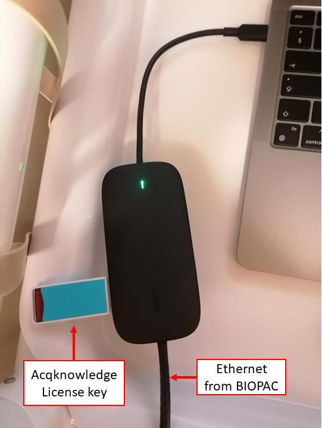
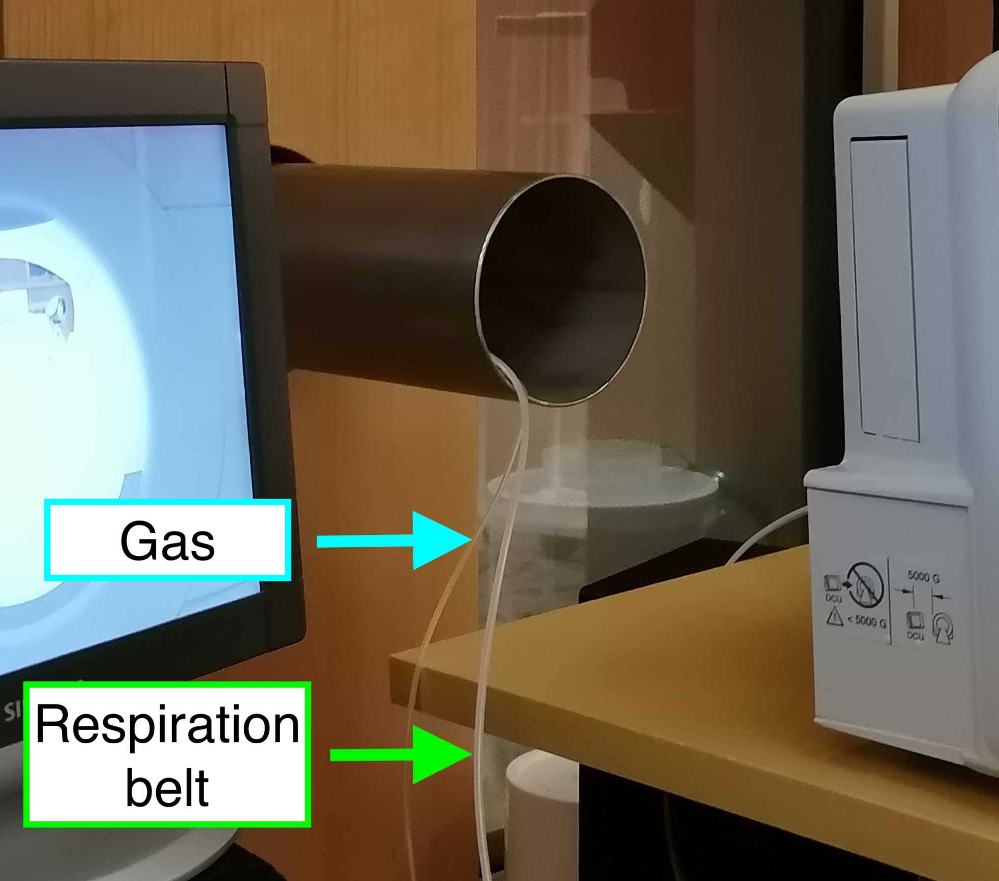
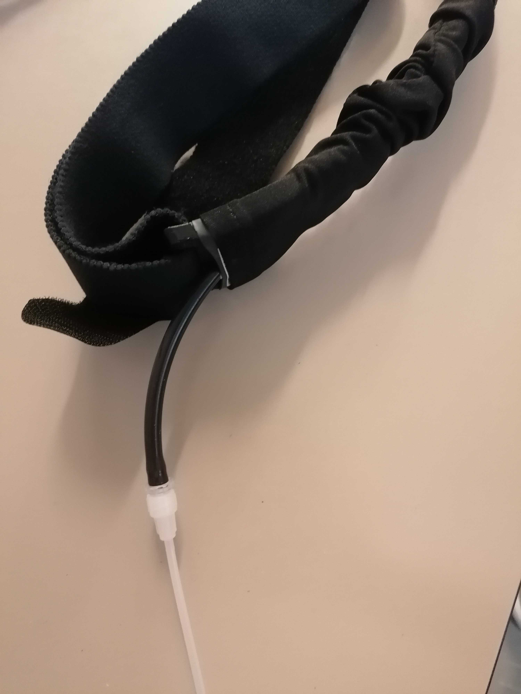
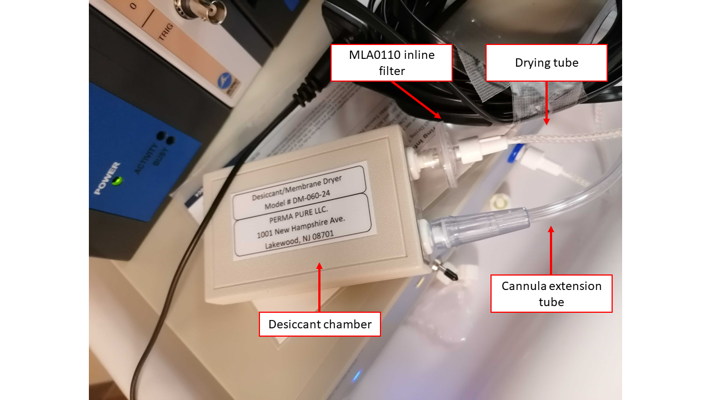
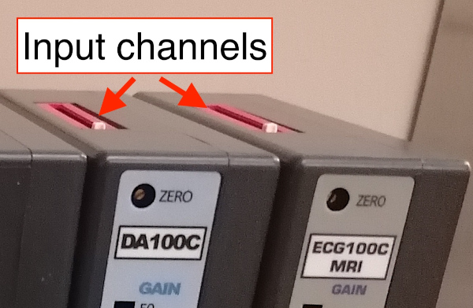
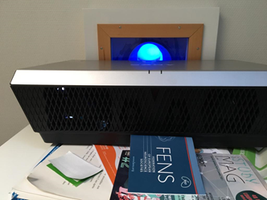
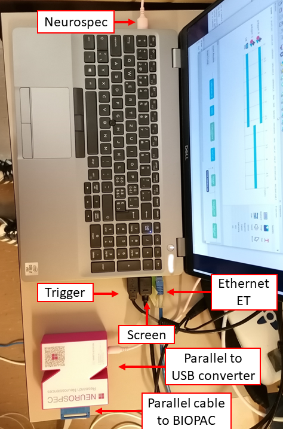

Instructions of operations to be performed before the participant arrival, **before EACH session** (i.e., DAY OF SCAN)


## Three days BEFORE THE FIRST SESSION

- [ ] Verify that as part of the [recruitement and screening procedure](../recruitment-scheduling-screening/recruitment.md), you have sent a copy of the MRI Safety and screening form ([EN](../assets/files/safety_form_EN.pdf)|[FR](../assets/files/safety_form_FR.pdf)) to the participant over email and confirm reception by checking the 'First contact email sent' column in [our recruits spreadsheet]({{ secrets.data.recruits_url | default("/redacted.html") }}).
- [ ] Verify also that you confirmed that the participant has read and understood the document, and in particular, you double-checked that they do not have any MRI contraindications, by checking the 'Phone interview done' and 'Participant volunteer and eligible' column in [our recruits spreadsheet]({{ secrets.data.recruits_url | default("/redacted.html") }}).
- [ ] If the phone call interview was more than three days before the first session, call the participant again to reconfirm the following information:
    - [ ] Remind the participant that any jewelry should be removed prior to the scan.
    - [ ] Indicate that they MUST shave the upper area of their chest where the ECG electrodes will be placed, if there is hair. The ECG electrodes MUST directly contact the skin.
    - [ ] Confirm clothing:
        - [ ] if allowed to wear street clothes, remind the participant to avoid clothing with metal or that would uncomfortable to lie in for the duration of the scan; otherwise
        - [ ] remark the participant they will be given a gown and they will need to change before every session.
    - [ ] Repeat at what time and where will you meet the participant.
    - [ ] Verify that the participant has your phone number {{ secrets.phones.study | default("███") }} to call you in case he gets lost.
    - [ ] **FEMALE PARTICIPANTS ONLY**: Remind the participant that pregnant women cannot undergo our MRI protocols. Therefore, they will take a pregnancy test (which we will have prepared) before the first session.
- [ ] If participant has indicated nervousness or history of claustrophobia, organize a session to use the mock scanner.

## BEFORE DAY OF SCAN

- [ ] Print [the informed consent form](../assets/files/icf_FR.pdf) (**first session only**), an MRI safety screener ([EN](../assets/files/safety_form_EN.pdf)|[FR](../assets/files/safety_form_FR.pdf)) and a receipt form for each participant that will get scanned.
- [ ] Make sure you have internet access, and update the [HCPh-fMRI-tasks repository](https://github.com/TheAxonLab/HCPh-fMRI-tasks) on *{{ secrets.hosts.psychopy | default("███") }}*:
    ```
    git fetch upstream
    git checkout main
    git rebase upstream/main
    ```
- [ ] On the *{{ secrets.hosts.psychopy | default("███") }}* laptop, open a terminal and execute `conda deactivate`.
- [ ] Open psychopy 3 by typing `psychopy`
- [ ] Load in the different experiments and check for proper functioning:
    - [ ] {{ settings.psychopy.tasks.func_rest }} (resting-state fMRI):
        - [ ] time it to [confirm the length](preliminary.md#task-timing), and
        - [ ] check that the movie is played.
    - [ ] {{ settings.psychopy.tasks.func_bht }} (breath-holding task, BHT):
        - [ ] time it to [confirm the length](preliminary.md#task-timing), and
        - [ ] check that the movie is played.
    - [ ] {{ settings.psychopy.tasks.func_pct }} (positive-control task, PCT):
        - [ ] time it to [confirm the length](preliminary.md#task-timing), and
        - [ ] check that the movie is played.

## Documentation and other non-experimental devices

- [ ] Prepare [the informed consent form](../assets/files/icf_FR.pdf) (**first session only**)
- [ ] Prepare an MRI safety screener ([EN](../assets/files/safety_form_EN.pdf)|[FR](../assets/files/safety_form_FR.pdf))
- [ ] Prepare a pen and a receipt form that the participant will sign when they are given the compensation
- [ ] Check you have the AcqKnowledge software USB license key
- [ ] Prepare a pregnancy test (**Only female participants on their first session**)
- [ ] Prepare a thermometer
- [ ] Prepare a blood pressure meter
- [ ] Prepare scrubs and MR-compatible glasses if applicable
- [ ] Prepare a pack of sterile cotton gauze, a bottle of medical alcohol, the *Nuprep* skin preparation gel (white/blue tubes), and three new electrodes.

    

- [ ] Verify that your phone is on ringing mode so the participants can reach you
- [ ] Check the time regularly to be on time to meet with the participant at the predefined location

## Boot the scanner up if it is shut down

!!! warning "Please wait for all systems to finalize their boot-up (about 10 minutes), even if only the satellite station is to be used."


- [ ] Turn the key of the **System ON/OFF Station Box** into the *open lock* position (:fontawesome-solid-unlock:)
- [ ] Push the blue button with the sun symbol :octicons-issue-opened-16: and the **SYSTEM ON** label above, which is found right above the key

## Basic preparations in the scanning room

- [ ] If any head coil from the last exam is still plugged, remove it:
    - [ ] If it is the 64-channel coil, you can just temporarily move it into the scanner's bore.
    - [ ] Otherwise, store it on the shelf where the other coils are and bring the 64-channel one in the proximity of the bed (e.g., inside the scanner's bore). Make sure to remove other coil's fitting element.
- [ ] Remove the spine coil by lifting the corresponding latch, then sliding it toward the head of the bed, lift it from the bed, and place it on the floor ensuring it is not obstructing any passage or unstable.
- [ ] Place the two back padding elements filling the spine coil socket.
- [ ] Cover the MRI bed with a sheet.
- [ ] Place the 64-channel head-and-neck coil into its socket at the head end of the bed.
- [ ] Completely remove the light inside of the scanner and the ventilation of the scanning room using [the scanner's interface](scanning-notes.md#scanners-settings-buttons).

    !!! danger "Remove the light and ventilation to facilitate the best performance of the ET"

## Setting up the BIOPAC system and physiological recording sensors

- [ ] Ensure you have the *AcqKnowledge* software USB license key. Plug the USB key to the multiport adapter for Mac and plug that adapter to the computer *{{ secrets.hosts.oesteban | default("███") }}* as shown in the picture below. **It needs to stay plugged at all times during the acquisition.**
- [ ] Open the *AcqKnowledge* software
- [ ] Initiate an *Amphetamin* session to avoid the computer to go to sleep/lock the screen:
    - [ ] Click on the pill icon on the Mac's status bar
    - [ ] Select *New session* ⤷ *While is running* ⤷ *Acqknowledge*.
- [ ] Plug the power cord of the BIOPAC and of the GA into suitable power sockets.
- [ ] Plug in the Ethernet (the plug is on the back side of the BIOPAC) to the multiport adapter connected to the computer *{{ secrets.hosts.oesteban | default("███") }}*.
    
    
- [ ] Connect the parallel cable to the 25-pin socket at the back of the SPT100D of the BIOPAC and to the parallel port of the MMBT-S Trigger Interface Box adapter (N-shaped pink box).
    

    

- [ ] Plug the power cords of the BIOPAC and the GA into suitable power sockets.
- [ ] Go inside the scanning room, unscrew the wood cap that covers the hole in front of the MR.
- [ ] Check that the extension tube for the nasal cannula does not contain any bubbles.
- [ ] Delicately pass the extension tube that will be connected to the nasal cannula and the extension tube from the respiration-belt (RB) through the front access tube.

- [ ] Connect the distal end of the extension tube to the cannula and leave the cannula ready on the bed ready for the participant.
    To connect the extension tube to the cannula, you need to insert with force the end into the cannula.

    !!! warning "Ensure that the length of the tubing inside the MR room is sufficient so that it can lie on the floor."

        When the tubing is hanging, pressure waves may alter the recorded gas concentration.


- [ ] Connect the distal end of the RB tube to the RB and leave it on the bed.

- [ ] Go back to the control room and connect the proximal end of the cannula extension tube to one plug of the desiccant chamber (which one is not important). Connect the MLA0110 inline filter to the other plug of the desiccant chamber. Connect the MLA0343 drying tube to the MLA0110 inline filter.



- [ ] Remove the cap of the gas input (Sample In, front panel of the GA) and connect the MLA0110 inline filter to it. The inline filter MUST be replaced after some ten sessions.

- [ ] Connect the coaxial end of the BNC-BNC cable to the CO<sub>2</sub> output in the back of the GA and connect the other end (jack plug) into the input end of the INISO/A filter.

- [ ] Connect one end (RJ-11 to RJ-11) to the output of the INISO/A filter, and the other into **channel 3** of the AMI100D BIOPAC module.

- [ ] Check that the RB (DA100C) and ECG (ECG100C MRI) channels are set to **channel 1** and **channel 2**.


!!!warning "Important"
    - [ ] Check that the exhaust pipe (back of the GA) is free of obstruction. An obstructed exhaust can damage the device!


- [ ] Check that the cap on `Sample In` is removed and that the MLA0110 inline filter is connected to it. The **pump switch MUST BE OFF when the cap is on and when switching on the GA**. Turn the GA on using the on/off switch located at the front of the GA. The GA **MUST be ON for 20-30 min** to warm-up before measuring.

- [ ] Check that the flow control wheel (front of the GA) is set to the maximum.
- [ ] Connect the proximal end of the RB tube to the TSD160A BIOPAC unit, using the plug marked negative (**-** symbol).
- [ ] Connect the cable from the RJ-45 output of the syncbox to the first filter (BNC connector; has a label "External signal") in the cupboard covering the access panel to the Faraday cage. The cable might be stored in the lower left cupboard of office {{ secrets.rooms.et_camera | default("███") }}. Make sure you will have access to the cable with sufficient time ahead. [INSERT PICTURE]
- [ ] Connect the syncbox to the Biopac via the white trigger cable. [TOCHECK]

## Setting up the projector

- [ ] Go to room {{ secrets.rooms.projector | default("███") }}, where the projector is installed.
- [ ] Switch the projector **ON** by hitting the power button, located on its right side.
    Adjust the projector tilt to center the projection if it does not properly aim the panel inside the scanner's bore.
    E.g., change the height of the paper pile that supports it (see images, FENS papers).

    |  |  |  |
    |:--:|:--:|:--:|
    | *The hole is the part through which you should check the quality of the projection* {: colspan=3} | | |

- [ ] Verify that the projector projects your laptop screen by looking through the window of the console room.
- [ ] Before you exit room {{ secrets.rooms.projector | default("███") }}, go to the next step.

## Setting up the eye-tracker (ET) computer

- [ ] The eye-tracker (ET) computer is kept on its designated rolling table, which is stored under the projector in room {{ secrets.rooms.projector | default("███") }}.
    Behind the rolling table, there is a transparent panel (the *plexiglas* in the following) where the ET arm will stand inside the scanner bore.
- [ ] Verify that the screen, the cables, as well as the ET computer are fixated onto the rolling table with scotch tape.
- [ ] Bring the rolling table out of the projector room ({{ secrets.rooms.projector | default("███") }}) into the control room.
    Be very attentive during the displacement and lift the front wheels when passing steps or cables.
    The plexiglas panel can also be brought to the scanning room at this time, if done with care.
- [ ] Place the rolling table it next to the access closet.
- [ ] Connect the Ethernet cable from the ET computer into the Ethernet plug of the *Psychopy laptop* ({{ secrets.hosts.psychopy | default("███") }}).
- [ ] Connect the power strip attached to the rolling table on to the closest power plug (likely, a power strip coming across the corridor).

## Setting up the ET arm

??? thanks "Thanks to Benedetta Franceschiello!"

      All the documentation about the ET is derived from Benedetta Franceschiello's user guide.
      We greatly appreciate her help with the device.

- [ ] Go to room {{ secrets.rooms.et_camera | default("███") }} and bring the blue box labeled *Eye-Tracker only for fMRI* into the scanning room.
    This box contains the ET arm with the camera and infrared lamp mounted on it, lenses, and the special infrared mirror.
    The box should be found in the first cabinet on the left section of the cupboard.
- [ ] Take the MR-compatible lens out of the lenses box.

    |  |  |
    |:--:|:--:|
    | *The appropriate lens is found in a correspondingly labeled bag (left) and it is the only one with two gold screws (right).* {: colspan=2} |

- [ ] Install the MR-compatible lens, after removing any other present lens.
    If other lens is present, put it back into its plastic bag inside the lenses box after unscrewing and removal.

    !!! danger "The lens MUST be handled with care"

        1. The lens MUST be installed in the Control Room, BEFORE taking the ET arm inside the Scanner Room.
        1. One of your hands MUST be under the lens at all times while screwing/unscrewing it, to avoid accidentally dropping a lens.

            

        1. Screws holding the lens MUST be properly tightened at this point because the vibration of the scanner may loosen them and the screw(s) drop during the session.

- [ ] Open the door of the access cupboard.
- [ ] With the help of someone else, pass the optic fiber (orange wire) and the power cable (the one with a fabric sheet) through the access point.

    !!! warning "This operation requires two people"

        One person will feed the cables from the control room interface of the access cupboard.
        The other person will gently pull the two cables from inside.
        Both people will lift the cable to avoid its abrasion with the edges of the metallic cylinder, which is the passage between exterior and interior of the scanner room.
        Once the sliding of the cable is finished, leave the extremities inside the scanner room in the left-top corner, far from the scanner because they are magnetic.

        

    !!! important "Since someone will enter the Scanning Room to receive the cables, this is a perfect moment for the helper from inside to take the plexiglass panel with them when entering the Scanning Room."

## INSIDE the scanner room

- [ ] Take the ET arm inside the Scanning Room (check that the plexiglass panel is already inside the Scanning Room, and bring it inside with you if not).
- [ ] Place the plexiglass standing panel inside the scanner bore: a sign notes the top side that faces up.
    The plastic feet must face down to avoid the panel to slide.
    To ensure the repeatible positioning of the ET, place the end of the plexiglass such that its edge aligns with the edge of the illuminated MRI rails.
- [ ] Place the ET arm on top of the plexiglass panel with the two posterior feet of the ET arm aligned within the two corner signs made of scotch tape.

    !!! danger "Hold the ET arm FIRMLY, because the magnetic field imposes some resistance."

- [ ] Connect the cables (two plugs for the black, one plug for the orange).
    
- [ ] Take the half-circle one-direction screen from the table behind the scanner and put it on the back of the scanner, behind the ET system (don't push the plexiglass yet)
    

### Placing the infrared mirror

- [ ] Detach the standard mirror's frame from the head coil, if it is placed there.
    Remove unnecessary items from the scanning bed, and prepare the mirror to attach the infrared mirror of the ET at a later step.
- [ ] Prepare two long strips of scotch tape and leave them in a convenient place to attach the ET mirror later.
    E.g., attach the corner of each strip to the back part of the mirror frame.
- [ ] Go back to the control room and take the infrared mirror out of the «fMRI usage» box. **<span style="color:red">DO NOT EXTRACT THE MIRROR OUT FROM ITS BOX YET</span>**. The mirror's box is labeled as [*RELIQUIA DI SAN GENNARO*](https://it.wikipedia.org/wiki/San_Gennaro#La_reliquia) to emphasize that **THIS IS THE MOST DELICATE PART, BECAUSE THE MIRROR CANNOT BE REPLACED <span style="color:red">NOR CLEANED</span>**. This mirror is **EXTREMELY EXPENSIVE**.

    

- [ ] Get two gloves (e.g., from the box hanging at the entrance of the scanner room), then approach the scanner bed. Put the gloves on, and **DON'T TOUCH ANYTHING**. You MUST have the standard mirror dismounted and in front of you at this point. **WITH THE GLOVES** proceed to extract the infra-red mirror from its box, being extremely careful. **YOU CAN ONLY TOUCH THE MIRROR WITH GLOVES**, because it cannot be cleaned up. Watch out for **FINGERPRINTS** and once taken out of its box, **IMMEDIATELY PROCEED TO ATTACH IT** to the standard coil mirror. The mirror MUST NOT be placed anywhere else if not in its box.
- [ ] **WITH YOUR GLOVES ON**, attach the ET mirror to the standard coil mirror (the larger mirror that points toward projector's screen at the back of the scanning room) using the scotch tape strips you prepared before. Put it more or less in the center, although <span style="color:red">this position may need to be adjusted</span> (being careful and with the same precautions explained before). **Do not touch the surface of the ET mirror.**

    

    !!! danger "The infrared mirror MUST be airtight attached"

        It is critical that there is no air gap between the infrared mirror and the standard mirror.
        Also, make sure the scotch tape is firmly glued to the standard mirror because the infrared mirror will be hanging when placed on the coil and may loosen up creating a gap with the standard mirror.

    !!! warning "Suggestion"

        Since we are going to track the right eye only, it is useful to displace the infrared mirror to the
        right from the participant's standpoint and cut the scotch tape narrower to occlude less surface of the mirrors on the right side.

- [ ] Place the mirror frame back on the head coil. As always, **DO NOT TOUCH THE MIRROR**.

## Back OUTSIDE THE SCANNER ROOM (control room)

- [ ] Plug in the Power strip containing the ET Power Cable, the PC-tower power, etc
    
    

- [ ] Switch on the ET PC-tower. Select "Eyelink" when given the option of which operating system to launch.

    

- [ ] This is the sync box of the scanner, allowing a synchronization of the triggers between the scanner sequence and the ET recordings.

    

- [ ] Switch on *{{ secrets.hosts.psychopy | default("███") }}* and log-in with the username *{{ secrets.login.username_psychopy| default("███") }}* and password `{{ secrets.login.password_psychopy| default("*****") }}`.

- [ ] Connect to the ET to the *{{ secrets.hosts.psychopy | default("███") }}* laptop with the ethernet cable (blue color).


- [ ] Connect the sync box to the laptop with the USB cable. It is normally plugged into the {{ secrets.hosts.acqknowledge | default("███") }}, it must be re-plugged in after usage.

    

- [ ] Connect the *{{ secrets.hosts.psychopy | default("███") }}* laptop to the screen switch box (see picture below) with the corresponding HDMI cable. This should project your screen on the screen of CHUV's tower {{ secrets.hosts.acqknowledge | default("███") }}.
    

    !!! warning "If the monitor does not automatically switch the source of the screen, you can use the button below to switch it."

        

- [ ] Connect the MMBT-S Trigger Interface Box adapter (pink USB cable) to one of the USB ports of the laptop *{{ secrets.hosts.psychopy | default("███") }}*.
    

    !!! danger "The MMBT-S Trigger Interface MUST be connected to the laptop AFTER the trigger USB cable coming from the SyncBox. "

- Your laptop connections should now look like this.

    

- [ ] Configure the display settings of the laptop to mirror outputs and set a resolution of 800x600 for both screens. **That step and that exact resolution is crucial for the eye-tracker calibration to work.**

- [ ] Configure the display settings of the laptop to mirror outputs and set a resolution of 800x600 for both screens.
- [ ] Double check that the IP address corresponding to the ethernet interface of the *{{ secrets.hosts.psychopy | default("███") }}* laptop is correct. You can either run `ifconfig -a` or use the GUI. Make sure the IP/mask is **100.1.1.2/24**, and the protocol is IP version 4. Execute `ping 100.1.1.1` to see if the ET is responding to echoes.
- [ ] Check that the service to synchronize the triggers is up with `sudo systemctl status forward-trigger`.

    !!! warning "If the service is down, manually force its start"

        - [ ] Run `sudo systemctl start forward-trigger`
        - [ ] Recheck the status with `sudo systemctl status forward-trigger`.

    !!! important "These commands are executed with `sudo`"

        The console will prompt you for the common user password: `{{ secrets.login.password_psychopy | default("*****") }}`

- [ ] Check that you can send trigger events manually:
    - [ ] Enter the "Synchronization" menu by selecting it and pushing the enter button (&#x25CF;).
    - [ ] Hit the down arrow button (&#x25BC;) until you find "Send trigger"
    - [ ] Push the enter button (&#x25CF;) every time you want to send an <span class="keypress">s</span> character.
    - [ ] Check that the *{{ secrets.hosts.psychopy | default("███") }}* laptop types those triggers (e.g., on an open editor receiving keypresses, or the shell prompt).
    - [ ] Check that the BIOPAC is properly registering the trigger too. Every trigger sent should be seen in the *AcqKnowledge* GUI.
- [ ] Start the syncbox session:
    - [ ] Push the up arrow button (&#x25B2;) until you find "Start session"
    - [ ] Push the enter button (&#x25CF;) and the syncbox will be now waiting for the scanner's trigger signal to forward it.

    |  |
    |:--:|
    |  |
    |  |


## Final checks inside the scanning room

- [ ] Prepare padding: under-knee padding, neck padding, inflatable head-padding.
    - [ ] Wrap a sanitary cover around each padding.
    - [ ] The head padding should be chosen and adjusted to each participant depending on their head size so that their nose is only 1-2mm away from the anterior part of the coil.
        The anterior part of the head coil will be tight around the participant's nose, so ensure they are nonetheless comfortable.
- [ ] Prepare a blanket.
- [ ] Prepare a new pair of earplugs.
- [ ] Check the RB, ECG, and nasal cannula are prepared.
