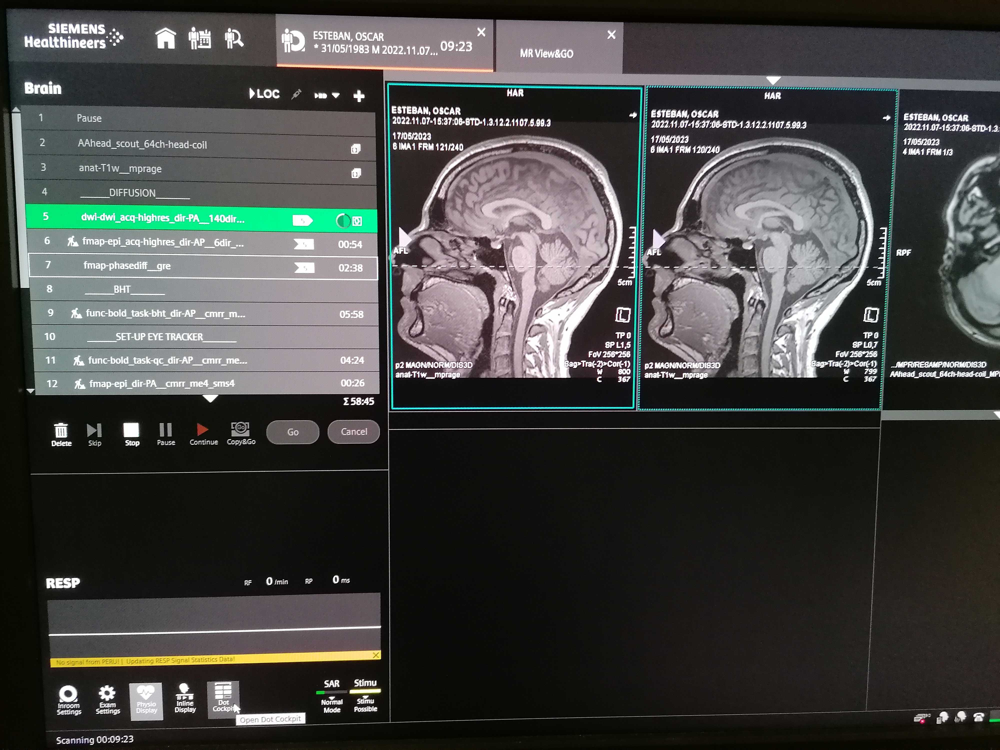
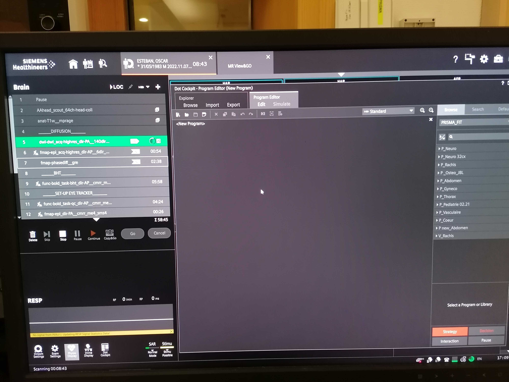
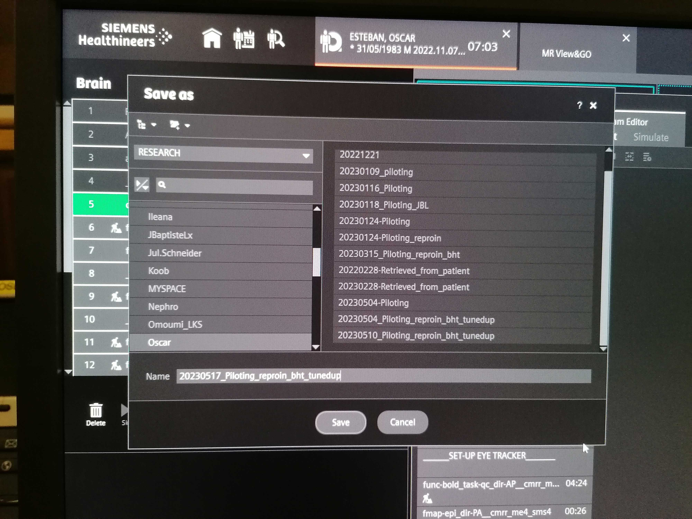

## Once, at the beginning of the project

!!! important "Emergency procedures"

    It is critical you fully understand and study the [emergency procedures to run an MRI scan at CHUV](./emergency-procedures.md).

### Install the gas analyzer (GA)

- [ ] Watch the gas analyzer (GA) video:
    <video id="wistia_simple_video_119" crossorigin="anonymous" style="background: transparent; display: block; height: 100%; max-height: none; max-width: none; position: static; visibility: visible; width: 100%; object-fit: fill;" aria-label="Video" src="https://embed-ssl.wistia.com/deliveries/5e08ccab25ab45382329671a82dfe5123f6e840e/file.mp4" playsinline="" preload="metadata" type="video/mp4" x-webkit-airplay="allow" controls>
      <source src="https://embed-ssl.wistia.com/deliveries/5e08ccab25ab45382329671a82dfe5123f6e840e/file.mp4" type="video/mp4" />
      Your browser does not support the video. <a href="./assets/files/GA_video.mp4">Click here to download it</a>
    </video>

### Install the BIOPAC

!!! important "BIOPAC documentation"

    Get familiar with the BIOPAC setup and read through the [hardware documentation](https://www.biopac.com/wp-content/uploads/MP_Hardware_Guide.pdf)

- [ ] Set up the line frequency switches on the back of the BIOPAC amplifier depending on your country frequency to reduce noise. Both switches should be DOWN if your country's line frequency is 50Hz. Both switches should be UP if your country's line frequency line is 60Hz.
    
- [ ] Plug the different units of the BIOPAC together if it has not been done yet.
- [ ] Get familiar with the BIOPAC system:
    - [ ] We use the BIOPAC to synchronize and output in a single file all the physiological recordings: cardiac pulsation, respiration and CO<sub>2</sub>  concentration.
    
    - [ ] The AMI100C unit can receive up to 16 analog signals. 
    - [ ] The DA100C unit records the signal coming from the respiration belt. Plug the TSD160A unit on the DA100C.
    - [ ] The ECG100C MRI unit records the electrical signal coming from the heart via the ECG. Plug the MECMRI-2 unit on the ECG100C unit.
    - [ ] The [SPT100D (solid state relay driver unit)](../assets/files/STP100D.pdf) is used to input digital signals that must be recorded (e.g., the trigger signals from the scanner)
- [ ] Ensure that the *Mode* switch of the [MMBT-S Trigger Interface Box adapter (pink color box)](../assets/files/MMBT-S_instruction_manual_v2.2.pdf) is set on the **P** position.
- [ ] Install the BIOPAC recording software (*AcqKnowledge*).
- [ ] Create a template *graph file* ([`EXP_BASE.gtl`](../assets/files/EXP_BASE.gtl))

    !!! important "Creating the *AcqKnowledge*'s template graph file"

        - [ ] Creating a graph file requires the BIOPAC system powered up and connected to the *{{ secrets.hosts.acqknowledge | default("███") }}* computer.
        - [ ] Add the RB module
            - [ ] Check the channel on top switch of the unit: the <mark>DA100C</mark> MUST be set on **channel 1**.
            - [ ] Under the tab *Analog*, click on *Add new module*.
            - [ ] Find the name of the BIOPAC unit corresponding to the <mark>DA100C</mark>.
            - [ ] Set the module settings (gain, filters, etc.) corresponding to those of the configuration switches in the front of the module.
            - [ ] When prompted to enter the calibration points, map the interval [-5, 0] to [0, 10]. You invert the sign of the interval for the interpretation to be more clear.
        - [ ] Add the ECG module
            - [ ] Check the channel on top switch of the unit: the <mark>ECG100C MRI</mark> MUST be set on **channel 2**.
            - [ ] Under the tab *Analog*, click on *Add new module*.
            - [ ] Find the name of the BIOPAC unit corresponding to the <mark>ECG100C</mark>.
            - [ ] Set the module settings (gain, filters, etc.) corresponding to those of the configuration switches in the front of the module.
            - [ ] When prompted to enter [calibration?], for the ECG you should map the interval ?? to ??.
        - [ ] Add the GA module
            - [ ] Confirm that the CO<sub>2</sub> output of the GA is connected through the ANISO filter to the **channel 3** of the AMI100C module.
            - [ ] Under the tab *Analog*, click on *Add new module*.
            - [ ] Select *Custom* and then indicate it is connected to **channel 3** by selecting *AMI/HLT - in3*.
            - [ ] When prompted to enter the calibration points, map the interval [0.03, 1.0] to [0, 10.0].
        - [ ] Add the Digital inputs
            - [ ] Under the tab *Digital*, click on *Add new module*.
            - [ ] The parallel cable feeds into ports <mark>D8-D15</mark>.
        - [ ] Configure the sampling frequency
        - [ ] Configure the experiment length (at least 2.5 hours)
        - [ ] Configure whether you want to collect directly to hard disk and autosave settings
        - [ ] Save the experiment, making sure you choose a "graph template file" (with extension `.gtl`)

### Setting up the Connection between the Biopac and the Psychopy Laptop:
- [ ] Copy the [latest version of the code to send triggers](https://github.com/TheAxonLab/hcph-sops/...)
- [ ] To automatically start the program when the BIOPAC is connected, create a udev rule as follows:
    ```
    sudo nano /etc/udev/rules.d/99-forward-trigger.rules
    ```
- [ ] Add the following rule to the file:
    ```
    ACTION=="add", KERNEL=="ttyACM0", SUBSYSTEM=="tty", TAG+="systemd", ENV{SYSTEMD_WANTS}="forward-trigger.service"
    ```
- [ ] Save the file and exit the editor.
- [ ] Run the following command to reload the udev rules:
    ```
    sudo udevadm control --reload-rules
    ```
- [ ] Create a systemd service unit file:
    ```
    sudo nano /etc/systemd/system/forward-trigger.service
    ```
- [ ] Add the following content to the file (Adapt the path to forward-trigger.py to the location on your computer):
    ```
    [Unit]
    Description=Forward Trigger Service
    After=network.target

    [Service]
    ExecStart=/usr/bin/python3 /path/to/forward-trigger.py
    WorkingDirectory=/path/to/forward-trigger/directory
    StandardOutput=null

    [Install]
    WantedBy=multi-user.target
    ```
- [ ] Save the file and exit the text editor.
- [ ] Run the following command to enable the service to start at boot:
    ```
    sudo systemctl enable forward-trigger
    ```
- [ ] Run the following command to reload the systemd daemon:
    ```
    sudo systemctl daemon-reload
    ```

### Verifying Trigger Transfer Without BIOPAC Connection:
- [ ] Ensure socat is installed (if not already):
    ```
    sudo apt-get update
    sudo apt-get install socat
    ```
- [ ] Create a virtual serial port and establish a symbolic link to `/dev/ttyACM0` using the following command:
    ```
    sudo socat PTY,link=/tmp/virtual_serial_port PTY,link=/dev/ttyACM0
    ```
- [ ] Adjust the permissions for the virtual serial port:
    ```
    sudo chmod 666 /dev/ttyACM0
    ```
- [ ] Install screen (if not already installed):
    ```
    sudo apt-get update
    sudo apt-get install screen
    ```
- [ ] Launch minicom, specifying the virtual serial port as the device:
    ```
    screen /dev/ttyACM0
    ```
- [ ] Press "s" and verify that "^A" appears in the screen terminal.


### Stimuli presentation: *psychopy*

- [ ] Prepare a laptop with a running Psychopy 3 installation AND the EyeTracker software.
    For these SOPs, the designated laptop for the experiments is *{{ secrets.hosts.psychopy | default("███") }}*.
- [ ] [Fork the HCPh-fMRI-tasks repository](https://github.com/TheAxonLab/HCPh-fMRI-tasks/fork) under your user on GitHub.
- [ ] Clone the [HCPh-fMRI-tasks repository](https://github.com/TheAxonLab/HCPh-fMRI-tasks):
    ```
    git clone git@github.com:<your-gh-username>/HCPh-fMRI-tasks.git
    ```
- [ ] Set-up the original repository as upstream remote:
    ```
    git remote add upstream git@github.com:theaxonlab/HCPh-fMRI-tasks.git
    ```
- [ ] Log on *{{ secrets.hosts.psychopy | default("███") }}* with the username *{{ secrets.login.username_hos68752| default("███") }}* and password *{{ secrets.login.password_hos68752| default("███") }}*.

- [ ] Clone the [PsychoPy repository](https://github.com/psychopy/psychopy.git):
    ```
    git clone git@github.com:psychopy/psychopy.git
    ```
- [ ] Navigate to the Psychopy directory:
    ```
    cd psychopy
    ```
- [ ] Psychopy should not be installed with anaconda. If an anaconda environment is activated, run the following command to deactivate it:
    ```
    conda deactivate
    ```
- [ ] Update pip to the lastest version:
    ```
    pip3 install --upgrade pip
    ```
- [ ] Install bdist_mpkg, py2app and attrdict:
    ```
    pip3 attrdict py2app bdist_mpkg
    ```
- [ ] Install Psychopy using the following command:
    ```
    pip3 install -e .
    ```
- [ ] Open Psychopy, open the experiment-files corresponding to each task:
    - [ ] {{ settings.psychopy.tasks.func_rest }} (resting-state fMRI):
        - [ ] time it to confirm the length, and
        - [ ] check that the movie is played.
    - [ ] {{ settings.psychopy.tasks.func_bht }} (breath-holding task, BHT):
        - [ ] time it to confirm the length, and
        - [ ] check that the movie is played.
    - [ ] {{ settings.psychopy.tasks.func_pct }} (positive-control task, PCT) :
        - [ ] time it to confirm the length, and
        - [ ] check that the movie is played.

    !!! important "Remember to time the three functional MRI runs (rest, qct, bht)"

        <a name="task-timing"></a>
        The lengths of the three runs should be:

        * {{ settings.psychopy.tasks.func_rest }} ➜ <mark>**{{ settings.mri.timings.func_rest }}**</mark>,
        * {{ settings.psychopy.tasks.func_bht }} ➜ <mark>**{{ settings.mri.timings.func_bht }}**</mark>, and
        * {{ settings.psychopy.tasks.func_pct }} ➜ <mark>**{{ settings.mri.timings.func_pct }}**</mark>.

### Eye-tracker: *EyeLink Software* installation

- [ ] Log on *{{ secrets.hosts.psychopy | default("███") }}* with the username *{{ secrets.login.username_hos68752 | default("███") }}* and password *{{ secrets.login.password_hos68752 | default("███") }}*.

- [ ] Enable Canonical's universe repository with the following command:
    ```
    sudo add-apt-repository universe
    sudo apt update
    ```
- [ ] Install and update the ca-certificates package:
    ```
    sudo apt update
    sudo apt install ca-certificates
    ```
- [ ] Add the SR Research Software Repository signing key:
    ```
    sudo apt-key adv --fetch-keys https://apt.sr-research.com/SRResearch_key
    ```
- [ ] Install the EyeLink Developers Kit:
    ```
    sudo apt install eyelink-display-software
    ```
- [ ] Install the EyeLink Data Viewer:
    ```
    sudo apt install eyelink-dataviewer
    ```

### Setting up the scanner protocol at the MR console

!!!warning "Important: follow Reproin conventions"

    When assigning names to the MR sequences in the protocol, make sure to follow the [Reproin conventions](https://dbic-handbook.readthedocs.io/en/latest/mri/reproin.html) to maximally facilitate the conversion into BIDS.


Once the protocol is decided upon, and after any updates, make sure of storing the protocol.

!!! warning "Login as an advanced user to save protocol"
    As a good practice, always work as the standard user `{{ secrets.login.username_scanner | default("janedoe") }}`.
    Change for *advanced user mode* if you want to save the protocol.

    - [ ] Simultaneously press the <span class="keypress">Tab</span> + <span class="keypress">Delete</span> + <span class="keypress">[→</span> on the control-computer's keyboard:
    
        > Username: `{{ secrets.login.superusername_scanner | default("superjanedoe") }}`
        >
        > Password: `{{ secrets.login.superuserpass_scanner | default("******") }}`

    !!! Danger "After three wrong password entries, access will be denied, and only a Siemens engineer will be able to unlock the MR scanner."

- [ ] Update the *Number of measurements* in all `func-bold_task-*` sequences, according to the [previously recorded timings](#task-timing):

    $$N_\text{measurements} = L_t / \text{TR}, \quad t \in \{\text{bht}, \text{pct}, \text{rest}\},$$

    where $L_t$ is the length of a particular task $t$ (either BHT, PCT, or resting state) in seconds as timed before, and
    $\text{TR}$ is the **repetition time** of the BOLD sequence, in seconds.

- [ ] Now that you are logged in as an advanced user, save your protocol:
    - [ ] Open the Dot-Cockpit window
        
    - [ ] In `Browse`, find the right folder to save the protocol in (*RESEARCH* ⤷ *Oscar*).
    - [ ] Right click on the folder and select *New* ⤷ *Program*. This opens an empty page in the program editor
        
        
    - [ ] Select all the sequences you want to run from the sequence list and click right to copy.
        
    - [ ] Drag or paste the copied sequences in the program editor.
        
    - [ ] Once finished, click on the floppy disk icon (<span class="flip">🖫</span>) in the upper left to save.
    - [ ] Give the protocol a relevant name starting with the date of acquisition in the format YYYYMMDD and click <span class="consolebutton">Save</span>.
        
    - [ ] If desired, the protocol details can also be downloaded as a pdf on a peripherical USB key.
        - [ ] Right-click on the protocol and select *Print*
        - [ ] Save the PDF in your USB key.
- [ ] Make sure you save a different protocol for each of the four PE directions (i.e., AP, PA, LR, RL).

## Every two months

### Calibrate the GA

- [ ] Get a gas bottle with a known CO<sub>2</sub> concentration between 5% and 10%.
- [ ] Connect the GA to the BIOPAC as described below and start recording signal.
- [ ] In the *AcqKnoledge* software, edit the configuration of the inputs, making sure you update the voltage range for input 3 (the GA), estimated as described in [the GA's manual](../assets/files/GA_manual.pdf)
- [ ] Update the template *graph file* ([`EXP_BASE.gtl`](../assets/files/EXP_BASE.gtl)) with the calibrated input.

## Three days BEFORE THE FIRST SESSION

- [ ] Verify that as part of the [recruitement and screening procedure](../recruitment-scheduling-screening/recruitment.md), you have sent a copy of the MRI Safety and screening form ([EN](../assets/files/safety_form_EN.pdf)|[FR](../assets/files/safety_form_FR.pdf)) to the participant over email and confirm reception by checking the 'First contact email sent' column in [our recruits spreadsheet]({{ secrets.data.recruits_url | default("/redacted.html") }}).
- [ ] Verify also that you confirmed that the participant has read and understood the document, and in particular, you double-checked that they do not have any MRI contraindications, by checking the 'Phone interview done' and 'Participant volunteer and eligible' column in [our recruits spreadsheet]({{ secrets.data.recruits_url | default("/redacted.html") }}).
- [ ] If the phone call interview was more than three days before the first session, call the participant again to reconfirm the following informations: 
    - [ ] Remind the participant that any jewelry should be removed prior to the scan.
    - [ ] Indicate that they MUST shave the upper area of their chest where the ECG electrodes will be placed, if there is hair. The ECG electrodes MUST directly contact the skin.
    - [ ] Confirm clothing:
        - [ ] if allowed to wear street clothes, remind the participant to avoid clothing with metal or that would uncomfortable to lie in for the duration of the scan; otherwise
        - [ ] remark the participant they will be given a gown and they will need to change before every session.
    - [ ] Repeat at what time and where will you meet the participant.
    - [ ] Verify that the participant has your phone number {{ secrets.phones.study | default("███") }} to call you in case he gets lost.
    - [ ] **FEMALE PARTICIPANTS ONLY**: Remind the participant that pregnant women cannot undergo our MRI protocols. Therefore, they will take a pregnancy test (which we will have prepared) before the first session.
- [ ] If participant has indicated nervousness or history of claustrophobia, organize a session to use the mock scanner.

## BEFORE DAY OF SCAN

- [ ] Print [the informed consent form](../assets/files/icf_FR.pdf) (**first session only**), an MRI safety screener ([EN](../assets/files/safety_form_EN.pdf)|[FR](../assets/files/safety_form_FR.pdf)) and a receipt form for each participant that will get scanned.
- [ ] Make sure you have internet access, and update the [HCPh-fMRI-tasks repository](https://github.com/TheAxonLab/HCPh-fMRI-tasks) on *{{ secrets.hosts.psychopy | default("███") }}*:
    ```
    git fetch upstream
    git checkout main
    git rebase upstream/main
    ```
- [ ] On the *{{ secrets.hosts.psychopy | default("███") }}* laptop, open a terminal and execute `conda deactivate`.
- [ ] Open psychopy 3 by typing `psychopy`
- [ ] Load in the different experiments and check for proper functioning:
    - [ ] {{ settings.psychopy.tasks.func_rest }} (resting-state fMRI):
        - [ ] time it to [confirm the length](#task-timing), and
        - [ ] check that the movie is played.
    - [ ] {{ settings.psychopy.tasks.func_bht }} (breath-holding task, BHT):
        - [ ] time it to [confirm the length](#task-timing), and
        - [ ] check that the movie is played.
    - [ ] {{ settings.psychopy.tasks.func_pct }} (positive-control task, PCT):
        - [ ] time it to [confirm the length](#task-timing), and
        - [ ] check that the movie is played.

