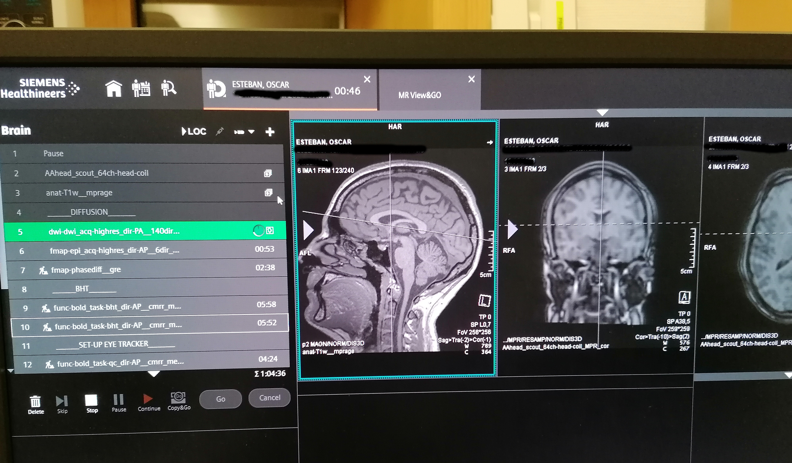
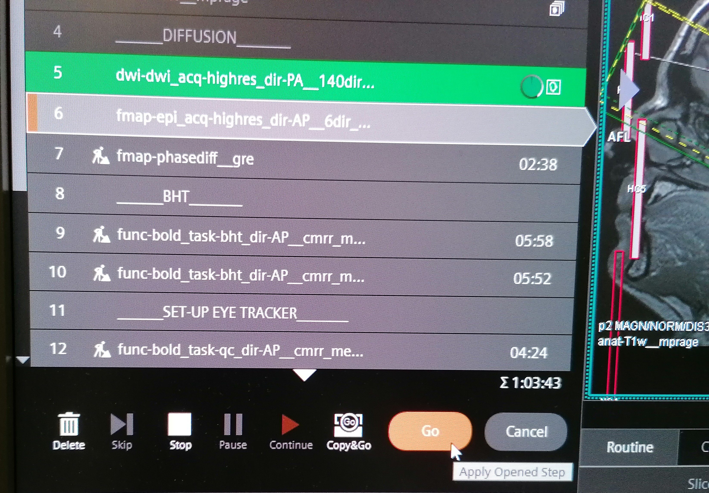
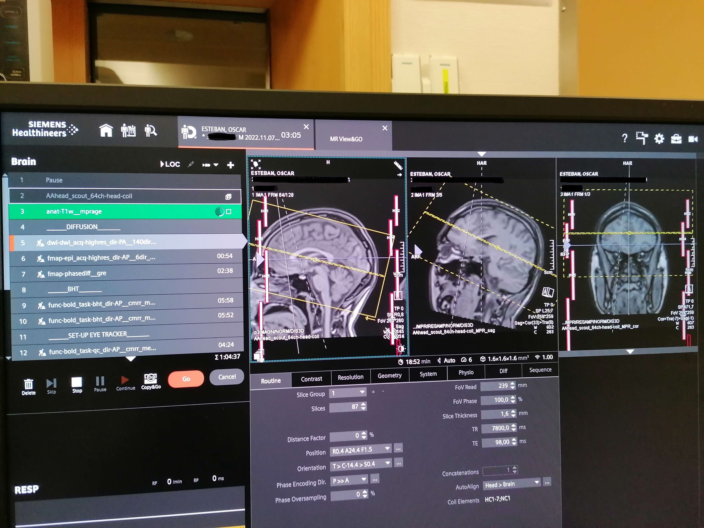

!!!danger "Familiarize with emergency procedures"
    You MUST know the security procedures in case of problem and keep yourself updated with changes.
    Some of the emergency procedures are found here [here](emergency-procedures.md).

    In addition to the brief guidelines given in these SOPs, further safety information is found in {{ secrets.tribu.mri_security | default("███") }}.

## During the session

- [ ] Check in with the participant frequently, not necessarily only at the scripted points.
- [ ] Watch for motion and arousal state using the ET's camera.
      If you detect motion or the participant falls asleep at inadequate points, use the speaker to inform them.

## Acquire a localizer (*AAhead_scout*)

!!! danger "DO NOT FORGET to check the readiness of the experimental setup at this point"

    - [ ] Check that the GA is connected, **the exhaust cap IS REMOVED**, switch it on if necessary, ensure **the PUMP IS ON**, and **turn the pump's power knob to MAXIMUM position**.
    - [ ] Check that the *{{ secrets.hosts.psychopy | default("███") }}* has enough battery, and plug the power cord if necessary.
    - [ ] Check that the *{{ secrets.hosts.psychopy | default("███") }}* computer is ready, with psychopy open, and with the appropriate version of experiments. Leave the computer with a pleasant screen projecting (e.g., a gray background).
    - [ ] Check that the *{{ secrets.hosts.acqknowledge | default("███") }}* computer has been prepared, with the *AcqKnowledge* software open and collecting data.
    - [ ] Check that the *{{ secrets.hosts.acqknowledge | default("███") }}* has enough battery, and plug the power cord if necessary.
    - [ ] Check that the *{{ secrets.hosts.acqknowledge | default("███") }}* has the *Amphetamine* app running and keeping the computer unlocked while *AcqKnoledge* is working.
    - [ ] Fix unanticipated problems (e.g., the respiration belt needs to be fastened more)

- [ ] Indicate the participant that the scanning will soon start:

    > Hey [NAME], we are about to start our first scan run.
    >
    > This is going to be a long session, so please make sure you are feeling as comfortable as you possibly can in there.
    > Remember not to cross your legs or hold your hands together and check your back is also comfortable.
    > I'm going to ask you to take a deep breath now, so I can check the respiration belt is properly set up.
    > If it is too tight, please let me know.
    > 
    > [Allow a few moments for the participant to breathe while you check the recordings]
    >
    > Okay, we seem to be able to track your respiration. Is the respiration belt too restraining?
    > This is also a good moment to swallow, and to check your neck and head are in a comfortable position.
    >
    > For this first part, all you have to do is stay still; you can relax and close your eyes if it helps.
    >
    > Are you ready?

- [ ] Wait for the participant confirmation and set the speaker off afterward.
- [ ] Launch the `AAhead_scout_{32,64}ch-head-coil` protocol by pressing *Continue*.
- [ ] Once the localizer is concluded, you can drag and drop the image stack icon (something like 🗇, with an object on the top stack) onto the image viewer. That will open the localizer on the viewer.

    

### If the localizer presents very low quality

!!! warning "The localizer may present very low quality if the head-coil has not been properly initiated by the scanner"

- [ ] Enter the scanning room, extract the participant from the scanner by pressing the home (🏠) button.
- [ ] Tell the participant that you need to reset the head coil
- [ ] Unplug and replug the head coil
- [ ] Check that the coil has been properly detected in the scanner's monitor
- [ ] Re-insert the participant in the scanner
- [ ] Re-run the `AAhead_scout_{32,64}ch-head-coil` protocol.

## Acquire a high-resolution, anatomical image

- [ ] Launch the `anat-T1w__mprage` protocol by pressing *Continue* (**⯈**).

    !!! warning "While you are still running the MPRAGE sequence"
        - [ ] Open the parameters of the sequence named `fmap-phasediff__gre` and ensure that under *Contrast>Reconstruction* the option *Magnitude et phase* is selected. This is crucial so that both the magnitude and the phase difference field map images are saved.
        - [ ] Repeat the configuration of *Magnitude et phase* for all sequences name `fmap-epi_dir-*`.
        - [ ] Repeat the configuration of *Magnitude et phase* for all sequences name `func-bold_task-*`.
        - [ ] Open the `dwi-dwi_dir-*` sequence and under the section *Diff.*, uncheck all the derivatives except for *Diff. Weighted Image*.

## Acquire the diffusion MRI run
    
- [ ] [Adjust the FoV](#setting-the-fov) of the `dwi-dwi_dir-*` sequence as indicated below.
- [ ] Verify again the `dwi-dwi_dir-*` parameters under section *Diff.*. All the derivatives MUST be unchecked except for *Diff. Weighted Image*.
- [ ] Inform the participant that the diffusion scan will follow.

    > Hey [NAME], the next block is a bit long, around 30 minutes.
    >
    > You can close your eyes and even sleep if you wish.
    >
    > I'm going to give you a short time (ten seconds or so) to swallow, and perhaps accommodate your back or your arms. However, please try not to move your head.
    >
    > It is critical that you don't move, especially at all at the very beginning and the next 20 seconds after you hear the first blipping sounds.
    >
    > Try to minimize swallowing, and eye movements (for example, blinking) and try to maintain comfortable and shallow breathing.
    >
    > Are you ready?

    !!! note "Only for the participant of Cohort I"

        Hey Oscar, we are ready to proceed with the diffusion scan.
        The BIOPAC is functional and *AcqKnowledge* is properly registering the respiration belt and ECG.
        The gas analyzer is ON, but it is still warming up.
        The psychopy computer is ready.
        Are you ready?

- [ ] Launch the diffusion `dwi-dwi_dir-*` sequence by pressing *Continue* (**⯈**).
- [ ] While it is running, [adjust the FoV](#setting-the-fov) for the following sequence.

### Once the main diffusion MRI run is done, proceed with fieldmaps
- [ ] Launch the DWI B0 fieldmapping sequence `fmap-epi_dir-*`.
- [ ] While it is running, [adjust the FoV](#setting-the-fov) for the following sequence.
- [ ] Launch the fieldmap GRE B0 fieldmapping sequence `fmap_phasediff_gre`.
- [ ] While it is running, 
    - [ ] [Adjust the FoV](#setting-the-fov) for the following sequence.
    - [ ] Verify that in the next sequence parameters under Contrast>Reconstruction the option `Magnitude et phase` is selected!
- [ ] Launch the EPI BOLD B0 fieldmapping sequence `fmap-epi_dir-*`. 
- [ ] While the fieldmap sequence is running,
    - [ ] [Adjust the FoV](#setting-the-fov) for the quality-control-task (`task-qct`) fMRI sequence following the abovementioned steps.
    - [ ] Verify that the quality-control task `control_task.psyexp` is open in psychopy, that you calibrated the ET.

## Acquire the functional MRI block
- [ ] Inform the participant about the fMRI block

    > Hey [NAME], we are now to move into measuring the activity of your brain.
    >
    > Is everything alright thus far?
    >
    > [Allow some time for response]
    >
    > Before we start, we need to calibrate the eye-tracker device, which follows your right eye during experiments.
    >
    > Your are going to see a round fixation point, and the point is going to move randomly over the screen space.
    > Please follow it with your gaze, trying to look at it as stable as possible.
    > 
    > Are you ready?

- [ ] Wait for confirmation, respond to follow-up comments, and [initiate the ET calibration (instructions below)](#eye-tracker-calibration)

### Quality control task (QCT)
- [ ] Verify that the task's program is awaiting the scanner's trigger to start.
- [ ] Inform the participant that we will proceed with the quality control task (QCT). Repeat task instructions.

    > Hey [NAME], thanks for your collaboration with the eye tracking calibration.
    >
    > The following block will collect some behavioral data and requires your collaboration.
    > You will be exposed to several activities.
    >
    > Whenever you see a red circle, please fix your gaze on it, wherever it is shown on the screen.
    > If the red circle moves, we ask you to follow it with your eyes.
    >
    > Some other times, you'll see either "RIGHT" or "LEFT" written on the screen. During those times, please tap your thumb and the other fingers of your right or left hand as indicated on the screen.
    >
    > Before we start, please leave the alarm button on your tummy to free your hand for finger tapping. Please do not hesitate to grab it in case you need to squeeze it.

- [ ] Launch the `func-bold_task-qct_dir-XX` protocol by pressing *Continue* (**⯈**).
- [ ] Wait for the calibration scans to be finished (the process is reported on the bottom left corner of the console) and verify that the first volume's trigger signal was received by *{{ secrets.hosts.psychopy | default("███") }}* (meaning **CHECK that the task program was initiated**).
- [ ] While it is running:
    - [ ] [Adjust the FoV](#setting-the-fov) for the following sequence, and
    - [ ] double check that it has the setting *Magnitude et phase* selected in the drop-down menu under *Contrast>Reconstruction*.
- [ ] Once the sequence is over, you need to stop manually the psychopy task by clicking on `t` (as fast as possible to avoid collecting more data than needed).
- [ ] Once the sequence is over, close the current experiment on psychopy and open `resting_state.psyexp`.

### Resting state fMRI
- [ ] Inform the participant:

    > Thanks [NAME], that was a short behavioral task.
    >
    > Before moving on, we will run another calibration of the eye tracker, please follow the moving fixation point.
    >
    > Is everything alright?

- [ ] Wait for confirmation, respond to follow-up comments, and [initiate the ET calibration (instructions below)](#eye-tracker-calibration)
- [ ] Once the ET is calibrated, verify that the task is left and awaiting for the sequence's trigger to start.
- [ ] Inform the participant that the next sequence is resting-state fMRI (rsfMRI).

    > Hey [NAME], we are about to start resting-state fMRI.
    >
    > For this scan, all you have to do is stay still, and look at the movie.
    > Please do not close your eyes, and it is particularly critical that you don't move at all in the initial moments of the acquisition block.
    >
    > Are you ready?

- [ ] Launch the rsfMRI sequence `func-bold_task-rest_dir-*` by pressing *Continue* (**⯈**).
- [ ] While it is running:
    - [ ] [Adjust the FoV](#setting-the-fov) for the following sequence, and
    - [ ] double check that it has the setting *Magnitude et phase* selected in the drop-down menu under *Contrast>Reconstruction*.
- [ ] Once the sequence is over, close the current experiment on psychopy and open `breath_holding_task.psyexp`.

### Breath-holding task (BHT)
- [ ] Inform the participant:

    > Thanks [NAME], that was a long behavioral block.
    >
    > Before moving on, we will run another calibration of the eye tracker, please follow the moving fixation point.
    >
    > Is everything alright?

- [ ] Wait for confirmation, respond to follow-up comments, and [initiate the ET calibration (instructions below)](#eye-tracker-calibration)
- [ ] Once the ET is calibrated, verify that the task is left and awaiting for the sequence's trigger to start.
- [ ] Inform the participant that the next sequence is breath-holding task fMRI. Repeat the instructions for the task.

    > Hey [NAME], we will proceed now with a breath-holding task.
    >
    > I remind you that you have to breathe following the cues of the colored rectangle.
    >
    > Green means "BREATHE IN", orange means "BREATHE OUT" and red means "HOLD YOUR BREATH".
    >
    > Remember to not follow the breathing instructions during the first block and to exhale the small amount of air you have remaining at the end of the hold.
    >
    > Are you ready?

- [ ] Launch the `func-bold_task-bht_dir-*` sequence by pressing *Continue* (**⯈**).
- [ ] While it is running, determine whether there is enough time to run the anatomical T2-weighted run. If so, [adjust the FoV](#setting-the-fov) for the following sequence. 
- [ ] Once the sequence is over, you need to stop manually the psychopy task by clicking on `t` (as fast as possible to avoid collecting more data than needed).

## Concluding the session
!!! warning "ONLY if time permits"
    
    - [ ] Launch the `anat-T2w_` protocol by pressing *Continue* (**⯈**)

- [ ] Inform the participant:

    > Thanks [NAME], the session has concluded and we will shortly let you out of the scanner.

- [ ] The exam is over, you can proceed with the [tear-down protocol](./tear-down.md).

## Quick guide to the protocol settings and configuration

### Editing a sequence
- [ ] Double click on the sequence name.
- [ ] After editing the sequence, you MUST store the changes if you want them to be kept by clicking on the *Go* button:

    

### Setting sequences for automatic start
- [ ] You can set the worker icon on the left of the sequence by clicking on it if you want to pause before starting that sequence. If the worker is not present, the sequence will launch automatically.

    

- [ ] Blocks with a name between double underscores `__*__` introduce an *Exam Paused* break.
    Such breaks prompt a modal dialog with the *Exam Paused* title like this:

    

    !!! warning "The *Patient has Contrast Agent* checkbox MUST always be unchecked, as this protocol does not involve a contrast agent""

- [ ] Click *Continue* when you are ready to proceed.

### Setting the FoV
!!! warning "Using the anatomical image to adjust the field-of-view (FoV) is RECOMMENDED"

    - [ ] Drag and drop the protocol's stack icon (🗇) corresponding to the `anat-T1w__mprage` sequence into the image viewer.
        The icon will appear AFTER the image has been acquired.

- [ ] Make sure that the FOV (yellow square) includes the whole brain by tilting or translating the FOV. If the full brain, including the cerebellum, do not fit in the FOV, favorise making sure that the cortex is fully enclosed in the yellow square. For reproduciblity, it is better if the FOV across sequences have a similar center and a similar tilt. However, if it is not possible, the priority remains to include the whole brain in the FOV. 
- [ ] If two sequences have the same resolution and the same number of slices, you can copy paste the FOV
    - [ ] Open the sequence for which you want to adjust the FOV/geometry
    - [ ] Right click on the sequence for which the FOV has already been carefully positioned
    - [ ] Select `Copy Parameters`
    - [ ] `Center of slice groups and saturation regions`
- [ ] Once the FOV is well placed, launch the sequence by pressing `Go`.

    

### Eye-tracker calibration
- [ ] Run the experiment by pressing the green play button. 
- [ ] Enter the session and participant number in the pop up window. The Eyelink system setup page opens.
- [ ] Press `C` to open the calibration mode to perform the calibration and validation.
- [ ] Exit the calibration mode by clicking on [WHAT?].
- [ ] Once the calibration of the ET is concluded, hit the `Esc` key on the laptop *{{ secrets.hosts.psychopy | default("███") }}* to exit the calibration mode continue the task's program.
