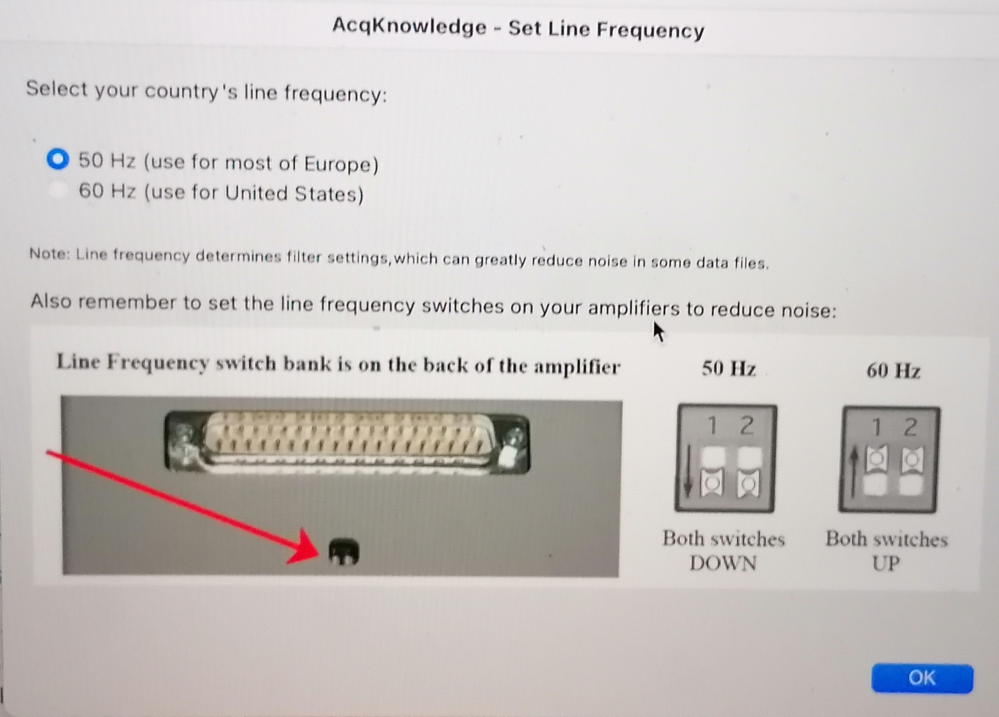
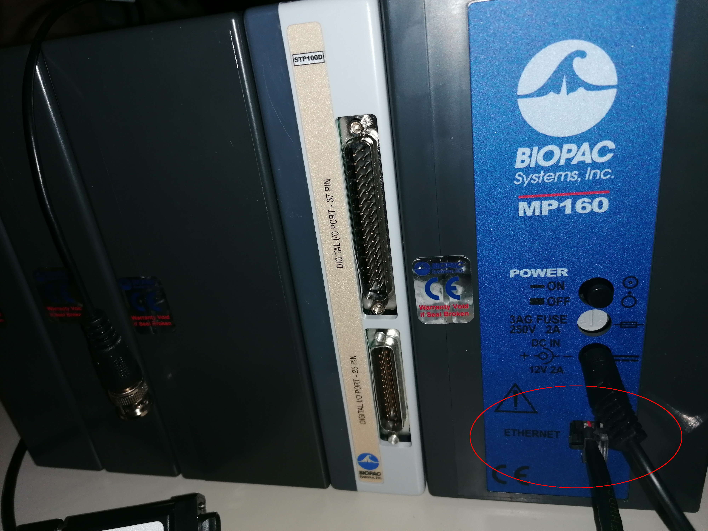
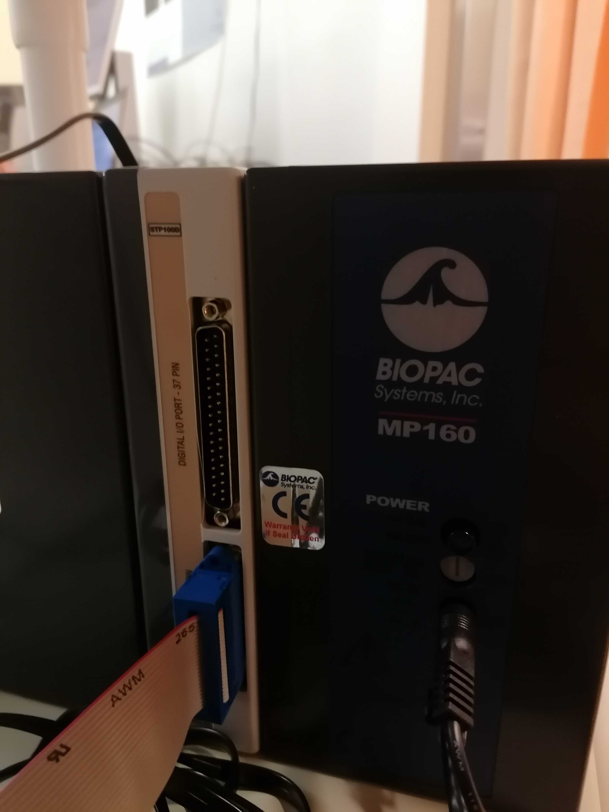
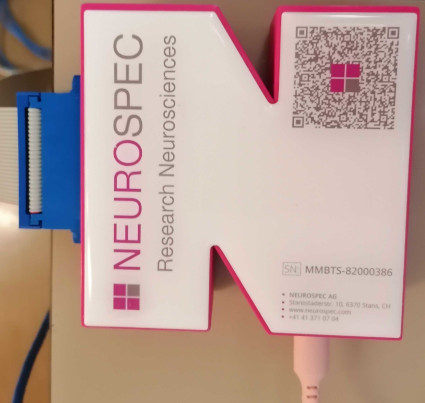
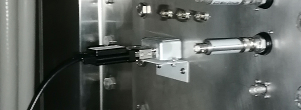
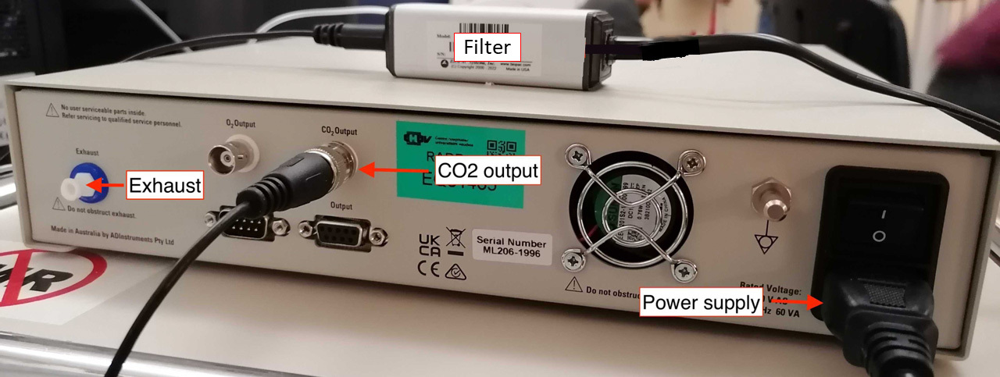
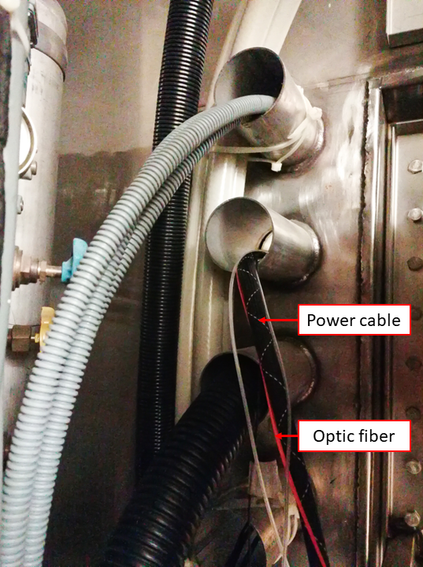

## Scanner

Once finalized the protocol development (before the first session of the first participant), the protocol(s) MUST be *frozen* and remain unchanged throughout the data collection effort.

- [ ] Create [the necessary protocols](intro.md#scanning-protocols) as described in the [protocol management section](notes-scanning.md#managing-protocols).

---

## Hardware: installation of instruments

Below is the overall setup of the instruments:

|  |
|:---:|
| **Stable configuration of the pyshiological and eye-tracking recording elements**. Most of the recording devices are located on a rack in the access panel cupboard of the Control Room. |

### Install the BIOPAC

- [ ] { width="300" align="right" }
    Set up the line frequency switches on the back of the BIOPAC amplifier depending on your country frequency to reduce noise.
    Both switches should be DOWN if your country's line frequency is 50Hz.
    Both switches should be UP if your country's line frequency line is 60Hz.
- [ ] Check that the RB ({{ settings.biopac.rb_unit }}) and ECG ({{ settings.biopac.ecg_unit }}) channels are set to **channel 1** and **channel 2**, respectively.
    
- [ ] Connect the {{ settings.biopac.model }}, {{ settings.biopac.digital }}, {{ settings.biopac.analog }}, {{ settings.biopac.rb_unit }}, and {{ settings.biopac.ecg_unit }} together if it has not been done yet.
- [ ] Plug in the Ethernet (the plug is on the back side of the BIOPAC), and leave it ready to connect the recording PC.
    
- [ ] Ensure that the *Mode* switch of the [{{ settings.biopac.pinkbox_long }} (pink color box)](../assets/files/MMBT-S_instruction_manual_v2.2.pdf) is set on the **P** position.
- [ ] Connect the micro-USB B end of a long USB-A to micro-USB B cable into the appropriate input socket of the {{ settings.biopac.pinkbox_long }} (N-shaped pink-color box).
    Leave the USB-A open end accessible for connection to the stimuli presentation computer *{{ secrets.hosts.psychopy | default("███") }}*.
- [ ] Connect the parallel cable to the 25-pin socket at the back of the {{ settings.biopac.digital}} of the BIOPAC and to the parallel port of the {{ settings.biopac.pinkbox}} (N-shaped pink box).

    |  |  |
    |:---:|:---:|
    | **Connection of digital signals** {: colspan=2} |

- [ ] Pass the RB's tube through the access cylinder with the help of one person inside the Scanning Room.
- [ ] Connect the RB's tube proximal end to the {{ settings.biopac.rb_trans }}'s inlet marked with the **minus** (-) symbol.
- [ ] Connect the parallel port end of the cable that comes out of the {{ settings.biopac.ecg_trans }} amplifier to the filter weld onto the access panel.
    
- [ ] **Inside the Scanning Room**, connect the MRI-compatible cable where the ECG leads will be connected to the parallel port weld to the access panel.
- [ ] Plug the power cord to the back socket of the BIOPAC and onto the multiple power socket extension.

### Install the GA

- [ ] Set the GA on the middle shelf of the rack.
- [ ] Connect two medical oxygen tubes (with length 4.2m each) with an adaptor.
- [ ] Pass the composite oxygen tube through the access cylinder with the help of someone else at the Scanning Room end.
- [ ] Connect the proximal end of the composite oxygen tube to one inlet of {{ settings.gas.chamber }} desiccant chamber.
- [ ] Connect the free inlet of the dessicant chamber to the {{ settings.gas.tube }} drying tube.
- [ ] Remove the cap of the gas input (Sample In, front panel of the GA).
    

- [ ] Connect the {{ settings.gas.valve }} flow valve to the gas inlet of the GA.

    !!! warning "The {{ settings.gas.valve }} flow valve MUST be replaced after some ten sessions."

- [ ] Connect the {{ settings.gas.tube }} drying tube to the {{ settings.gas.valve }} flow valve.
    

!!! warning "The {{ settings.gas.tube }} drying tube and the {{ settings.gas.chamber }} desiccant chamber MUST be replaced when their inside color turns into pink."

- [ ] Plug the power cord to the back socket of the GA and onto the multiple power socket extension.
    
- [ ] Connect the coaxial end of one BNC-jack cable to the CO<sub>2</sub> output in the back of the GA and connect the other end (jack plug) into the input end of the INISO/A filter.
    
- [ ] Connect one end (RJ-11 to RJ-11) to the output of the INISO/A filter you just installed.
- [ ] Connect the other RJ-11 end into **channel 3** of the {{ settings.biopac.analog }} module.
    
- [ ] Connect the coaxial end of the other BNC-jack cable to the O<sub>2</sub> output in the back of the GA and connect the other end (jack plug) into the input end of the INISO/A filter.
- [ ] Connect one end (RJ-11 to RJ-11) to the output of the INISO/A filter you just installed.
- [ ] Connect the other RJ-11 end into **channel 4** of the {{ settings.biopac.analog }} module.

### Install the ET computer

- [ ] Install the ET computer on the bottom shelf.
- [ ] Install the screen and peripherals (keyboard, mouse) on the top shelf, and connect them to the PC.
- [ ] Connect the power cord of the PC to the power multiple-socket extension.
- [ ] Pass the optic fiber (orange wire) and the power cable (the one with a fabric sheet) through the access cylinder with the help of someone else inside the Scanning Room.

    ??? warning "This operation requires two people"

        One person will feed the cables from the control room interface of the access cupboard.
        The other person will gently pull the two cables from inside.
        Both people will lift the cable to avoid its abrasion with the edges of the metallic cylinder, which is the passage between exterior and interior of the scanner room.
        Once the sliding of the cable is finished, leave the extremities inside the scanner room in the left-top corner, far from the scanner because they are magnetic.

        

### Cleanup inside the scanning room

Several tubes and cables will be now hanging from the access cylinder at the Scanning Room end.

- [ ] Roll these cables and tubes and store them organized in the cupboard, ready for their connection when needed.
- [ ] The RB may be stored with these cables and tubes to.

---

## Software

### Preparing the *physiology recording laptop* ({{ secrets.hosts.acqknowledge | default("███") }})

- [ ] Ensure you have the *AcqKnowledge* software USB license key. Plug the USB key to the multiport adapter for Mac and plug that adapter to the computer *{{ secrets.hosts.oesteban | default("███") }}* as shown in the picture below. **It needs to stay plugged at all times during the acquisition.**
    
- [ ] Install the BIOPAC recording software (*AcqKnowledge*).
- [ ] Open the *AcqKnowledge* software.
- [ ] Create a template *graph file* ([`EXP_BASE.gtl`](../assets/files/EXP_BASE.gtl))

    !!! important "Creating the *AcqKnowledge*'s template graph file"

        - [ ] Creating a graph file requires the BIOPAC system powered up and connected to the *{{ secrets.hosts.acqknowledge | default("███") }}* computer.
        - [ ] Add the RB module
            - [ ] Check the channel on top switch of the unit: the <mark>DA100C</mark> MUST be set on **channel 1**.
            - [ ] Under the tab *Analog*, click on *Add new module*.
            - [ ] Find the name of the BIOPAC unit corresponding to the <mark>DA100C</mark>.
            - [ ] Set the module settings (gain, filters, etc.) corresponding to those of the configuration switches in the front of the module.
            - [ ] When prompted to enter the calibration points, map the interval [-5, 0] to [0, 10]. You invert the sign of the interval for the interpretation to be more clear.
        - [ ] Add the ECG module
            - [ ] Check the channel on top switch of the unit: the <mark>ECG100C MRI</mark> MUST be set on **channel 2**.
            - [ ] Under the tab *Analog*, click on *Add new module*.
            - [ ] Find the name of the BIOPAC unit corresponding to the <mark>ECG100C</mark>.
            - [ ] Set the module settings (gain, filters, etc.) corresponding to those of the configuration switches in the front of the module.
            - [ ] When prompted to enter [calibration?], for the ECG you should map the interval ?? to ??.
        - [ ] Add the GA module
            - [ ] Confirm that the CO<sub>2</sub> output of the GA is connected through the ANISO filter to the **channel 3** of the AMI100C module.
            - [ ] Under the tab *Analog*, click on *Add new module*.
            - [ ] Select *Custom* and then indicate it is connected to **channel 3** by selecting *AMI/HLT - in3*.
            - [ ] When prompted to enter the calibration points, map the interval [0.03, 1.0] to [0, 10.0].
        - [ ] Add the Digital inputs
            - [ ] Under the tab *Digital*, click on *Add new module*.
            - [ ] The parallel cable feeds into ports <mark>D8-D15</mark>.
        - [ ] Configure the sampling frequency
        - [ ] Configure the experiment length (at least 2.5 hours)
        - [ ] Configure whether you want to collect directly to hard disk and autosave settings
        - [ ] Save the experiment, making sure you choose a "graph template file" (with extension `.gtl`)

### Preparing the *stimuli presentation laptop* ({{ secrets.hosts.psychopy | default("███") }})

The stimuli presentation laptop and any other box you want to use for debugging and development will require a few additional software packages to be available.

#### Installing *EyeLink* (eye tracker software)

!!! warning "The *EyeLink* software MUST be installed BEFORE *Pychopy*"

- [ ] Log on *{{ secrets.hosts.psychopy | default("███") }}* with the username *{{ secrets.login.username_psychopy | default("███") }}* and password `{{ secrets.login.password_psychopy | default("*****") }}`.

- [ ] Enable Canonical's universe repository with the following command:
    ``` shell
    sudo add-apt-repository universe
    sudo apt update
    ```
- [ ] Install and update the ca-certificates package:
    ``` shell
    sudo apt update
    sudo apt install ca-certificates
    ```
- [ ] Add the SR Research Software Repository signing key:
    ``` shell
    curl -sS https://apt.sr-research.com/SRResearch_key | gpg --dearmor | sudo tee /etc/apt/trusted.gpg.d/sr-research.gpg
    ```
- [ ] Add the SR Research Software Repository as an *Aptitude* source:
    ``` shell
    sudo add-apt-repository 'deb [arch=amd64] https://apt.sr-research.com SRResearch main'
    ```
- [ ] Install the EyeLink Developers Kit:
    ``` shell
    sudo apt install eyelink-display-software
    ```
- [ ] Install the EyeLink Data Viewer:
    ``` shell
    sudo apt install eyelink-dataviewer
    ```

#### Installing our synchronization server

During the session, we run a synchronization server that acts as a hub for the signals (triggers, task events, etc.) that define the experiment.
For the best experience, we *daemonize* the synchronization service (meaning, we make it a service of the operative system that runs in the background).
To install it as a service, please follow [the documentation in the appendix](notes-software.md#setting-up-the-synchronization-service-as-a-daemon-in-the-background)

- [ ] Locate the latest version of the synchronization service on your system.
    It is within the SOPs repository, at ``{{ secrets.data.sops_clone_path | default('<path>') }}/code/synchronization/forward-trigger-service.py``.
- [ ] Install the necessary libraries <mark>as root</mark>:
    ``` shell
    sudo python3 -m pip install -r {{ secrets.data.sops_clone_path | default('<path>') }}/code/synchronization/requirements.txt
    ```
- [ ] Test the service is properly installed:
    ``` shell
    sudo python3 code/synchronization/forward-trigger-service.py --disable-mmbt-check
    ```

    !!! important "Use the `--disable-mmbt-check` flag only if you do not plan to connect the MMBT-S trigger box"

- [ ] Test operation with our test client:

    !!! tip "Check the server's log file at `/var/log/forward-trigger-service.log`"

    Open a separate terminal on a separate window
    Then, open and follow the log file:
    ``` shell
    less +F /var/log/forward-trigger-service.log
    ```

    Return to the original terminal, keeping the other window visible and execute:
    ``` shell
    python code/synchronization/forward-trigger-client.py
    ```

    The log file should now have added two lines like:
    ```
    2023-10-12 14:44:31.788 - INFO - Data received: <b'\x02'>
    2023-10-12 14:44:31.788 - INFO - Forwarded <b'\x02'>
    ```

??? important "Testing the service without the MMBT-S connected"

    Testing the service without the MMBT-S trigger box connected requires emmulating `/dev/ttyACM0`:

      - [ ] Ensure `socat` and `screen` are installed (if not already):
          ``` shell
          sudo apt-get update
          sudo apt-get install socat screen
          ```
      - [ ] Create a virtual serial port and establish a symbolic link to `/dev/ttyACM0` using the following command:
          ``` shell
          sudo socat PTY,link=/tmp/virtual_serial_port PTY,link=/dev/ttyACM0,group-late=dialout,mode=666,b9600
          ```
      - [ ] With `screen`, listen to the new virtual serial port:
          ``` shell
          screen /dev/ttyACM0
          ```

          !!! tip "Alternatively, you can check the server's log file at `/var/log/forward-trigger-service.log`"

      - [ ] Press <span class="keypress">s</span> and verify that `^A` appears in the screen terminal.

#### Prepare the *Psychopy* experiments

!!! tip "The appendix has some guides on [how to install *Psychopy*](notes-software.md#psychopy-installation)."

- [ ] Log on *{{ secrets.hosts.psychopy | default("███") }}* with the username *{{ secrets.login.username_psychopy| default("███") }}* and password `{{ secrets.login.password_psychopy| default("*****") }}`.

??? important "Make sure to load the correct environment"

    - [ ] Deactivate conda (if active):
        ``` shell
        conda deactivate
        ```
    - [ ] Load the new virtual environment:
        ``` shell
        source $HOME/psychopyenv/bin/activate
        ```

- [ ] [Fork the HCPh-fMRI-tasks repository](https://github.com/TheAxonLab/HCPh-fMRI-tasks/fork) under your user on GitHub.
- [ ] Clone the [HCPh-fMRI-tasks repository](https://github.com/TheAxonLab/HCPh-fMRI-tasks):
    ```
    git clone git@github.com:<your-gh-username>/HCPh-fMRI-tasks.git
    ```
- [ ] Set-up the original repository as upstream remote:
    ```
    git remote add upstream git@github.com:theaxonlab/HCPh-fMRI-tasks.git
    ```
- [ ] Open *Psychopy* and (optionally) a experiment file corresponding to a task by typing the following command in the terminal:
    ```
    psychopy --no-splash -b {{ settings.psychopy.tasks.func_qct }}.psyexp
    ```
- [ ] For each task, check the following:
    - [ ] `{{ settings.psychopy.tasks.func_qct }}.psyexp` (quality-control task, QCT):
        - [ ] time it to [confirm the length](intro.md#task-timing), and
        - [ ] check the task runs properly.
    - [ ] `{{ settings.psychopy.tasks.func_rest }}.psyexp` (resting-state fMRI):
        - [ ] time it to confirm the length, and
        - [ ] check that the movie is played.
    - [ ] `{{ settings.psychopy.tasks.func_bht }}.psyexp` (breath-holding task, BHT):
        - [ ] time it to confirm the length, and
        - [ ] check the task runs properly.
    - [ ] `{{ settings.psychopy.tasks.dwi }}.psyexp` (fixation point during DWI):
        - [ ] time it to confirm the length, and
        - [ ] check the task runs properly.

---

## Calibration of the GA

The *AcqKnowledge* software must be re-calibrated every two months, approximately.

??? important "A gas mixture bottle with a known CO<sub>2</sub> and O<sub>2</sub> concentrations is necessary"

    CO<sub>2</sub> concentration must be between 5% and 10%, while O<sub>2</sub> within 5% and 21%.
    A second reference mixture is necessary, and room air can be used, knowing that atmospheric contents by volume are 0.039 ±0.001%
    for CO<sub>2</sub> and 20.946 ±0.003% for O<sub>2</sub>.

- [ ] Connect the BIOPAC to the *Physiology recording laptop* ({{ secrets.hosts.acqknowledge | default("███") }}) as described in [this section](pre-session.md#setting-up-the-biopac-system-and-physiological-recording-sensors).
- [ ] Connect the *AcqKnowledge* License Key into a USB Port of the *Physiology recording laptop* ({{ secrets.hosts.acqknowledge | default("███") }}).
- [ ] Open *AcqKnowledge* software on the *Physiology recording laptop* ({{ secrets.hosts.acqknowledge | default("███") }}).
- [ ] Open the template *graph file* ([`EXP_BASE.gtl`](../assets/files/EXP_BASE.gtl))
- [ ] Edit the configuration of the inputs 3 (connected to the CO<sub>2</sub> output of the GA) and 4 (connected to the O<sub>2</sub> output of the GA).
    Lower and upper calibration points can be set by sampling the input a number of times with the *AcqKnowledge* utility.
- [ ] Overwrite the template *graph file* `EXP_BASE.gtl`.
